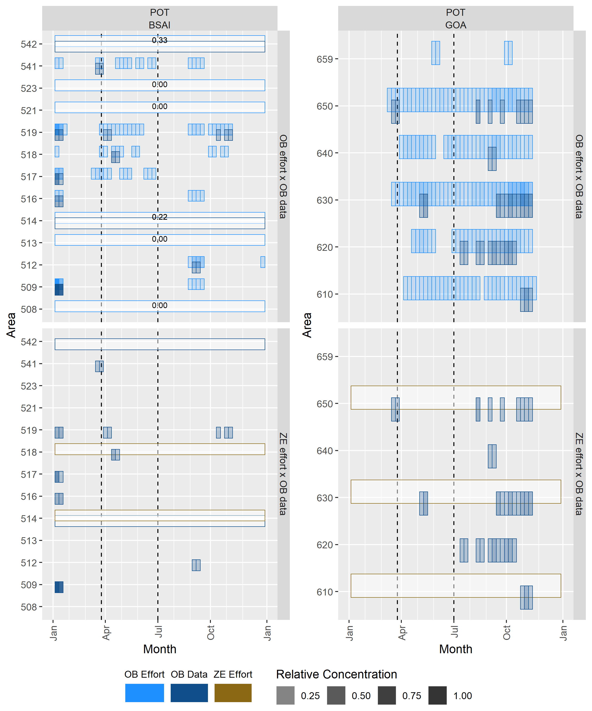

```{r, echo=FALSE, message=FALSE, warning=FALSE, eval=FALSE}
# Once report has been run and 4_AR_report.Rdata has been created,
# skip running the code below and load all packages and objects here:
# load("4_AR_report.Rdata")
# source("3_helper.R")
```

```{r, echo=FALSE, message=FALSE, warning=FALSE}
# Load packages and functions 
source("3_helper.R")
```

```{r, eval=FALSE}
#' Download data. Run this line manually during development, but it won't run during knitting.
gdrive_download("2_AR_data.Rdata", gdrive_set_dribble("Projects/AnnRpt-Deployment-Chapter"))
```

```{r, echo=FALSE, message=FALSE, warning=FALSE}
#' Load data and set parameters
load("2_AR_data.RData") # This includes the .Random.seed set in 1_AR_data.R

# Avoid scientific notation
options(scipen = 10000)

# Avoid dplyr summarise warnings
options(dplyr.summarise.inform = FALSE)

# Is this the annual report or the tech memo?
# This will control whether certain text chunks are included and formatting of table/figure captions.
annual.report <- TRUE
tech.memo     <- FALSE

if(annual.report){
  fig_nums <- captioner(prefix = "Figure 3-", auto_space = FALSE)  # In Annual report, deployment analyses make up Chapter 3. 
  tbl_nums <- captioner(prefix = "Table 3-", auto_space = FALSE)
}
```

```{r set-options, echo=FALSE, message=FALSE, warning=FALSE}
#Total deployment strata:
# 2 full coverage (FULL, EM TRW EFP[BSAI])
# 3 partial coverage observed (OB HAL, OB POT, OB TRW)
# 3 partial coverage EM (EM HAL, EM POT, EM TRW EFP[GOA]) + 
# 0 zero coverage EM research (Zero EM Research) +
# 1 zero coverage (ZERO)
total.strat <- nrow(unique(work.data[, .(COVERAGE_TYPE, STRATA)]))
```

`r if(tech.memo){'#Abstract'}`  
`r if(tech.memo){'This report contains the analyses and findings of the Alaska Fisheries Science Center’s Fisheries Monitoring and Analysis Division’s Fishery Monitoring Science Committee (FMSC) on the efficiency and effectiveness of observer deployment following the 2023 Annual Deployment Plan (ADP). Responses to comments by the North Pacific Fishery Management Council (Council) from the 2022 version of this report, and recommendations to improve data quality and guide the 2024 Annual Deployment Plan are also included. In 2023, there were 10 strata to evaluate: two full coverage strata, five (*THREE IF TENDER DROPPED*) partial coverage observer strata defined by gear and tender designation (*ARE WE COVERING TENDERS STILL?*), three partial coverage Electronic Monitoring (EM) strata defined by gear designation, one zero coverage EM research stratum, and one zero coverage stratum. Observers were deployed under trip-selection on *UPDATE:*161 full coverage vessels that fished for *UPDATE:*3,343 trips and *UPDATE:*584 unique partial coverage vessel and stratum combinations (vessels can fish in more than one stratum) that fished *UPDATE:*5,016 trips total. This was the *UPDATE:*second year in which data from the *EM HAL* stratum was used in catch accounting, and the *UPDATE:*first year in which data from the *EM POT* stratum was used in catch accounting. *UPDATE:*The *EM HAL* stratum was the third largest stratum by trip count in 2019 with 916 total trips fished. EM systems were deployed onto 21 pot vessels that fished for 165 trips. *UPDATE:*Research EM systems were deployed onto four vessels that fished for 29 trips. *UPDATE:*A total of 393 vessels fished 2,005 trips in the *Zero Coverage* stratum, accounting for 28% of all trips that occurred within the partial coverage category. Realized coverage rates met expectations in *UPDATE:*eight of ten strata in 2023. The *Full* stratum was observed at a rate of 99.9%, falling below the expected rate of 100%. *UPDATE:*The partial coverage *POT – Tender* stratum was observed at a rate of 29.5%, with a 95% confidence interval that fell above the expected coverage rate of 16.1%. *UPDATE:*However, deployment in 2019 generally proceeded as planned, with few missed expectations or signs of potential bias. The FMSC recommends that future ADPs fully integrate EM and observer deployment into one fishery monitoring program. Although EM data are now being used in catch accounting, the funding and selection of EM vessels has so far occurred separately from the processes used to optimize observer deployment in each ADP. Considering EM as a more integral part of those optimization processes will better enable analysts to avoid data gaps and take advantage of the respective abilities of each monitoring method (observers and EM). The FMSC also continues to recommend that NMFS link the ODDS and eLandings database such that fishing trips can be uniquely identified to support the analyses presented to the Council. Such a linkage will better enable analysts to discern the contributing factors behind instances in which intended deployment is inconsistent with realized deployment.'}`  

#Introduction  
`r if(tech.memo){'##Background of the North Pacific Groundfish and Halibut Observer Program'}`  
`r if(tech.memo){'Fisheries observers and electronic monitoring (EM) systems collect independent information that is used to determine the effects of fishing on natural resources. The National Marine Fisheries Service (NMFS) uses its observer program in Alaska to enable the use of tools such as catch quotas to manage against the over- or under-harvest of fishes. Observers and EM are two verifiable methods for collecting fishery discard information used to estimate total catch. Observers (but not the EM systems currently used in the North Pacific) are able to record seabird and marine mammal interactions with fisheries as well. Observers also collect biological information such as length, sex, weight, ageing structures (e.g., otoliths, spines, scales, and vertebrae), and stomachs to support ecosystem studies and stock assessments.'}`

`r if(tech.memo){'The observer program in the North Pacific has a long history. Observers were first deployed onto fishing vessels in the Bering Sea in 1973 and into the remainder of the North Pacific in 1975 (Nelson et al. 1981, Wall et al. 1981). Fisheries in the North Pacific were initially prosecuted exclusively by foreign and later by "joint venture"'}` `r if(tech.memo){"operations where a developing domestic fleet of catcher vessels delivered to foreign-owned processing vessels. During the foreign and joint venture operations, foreign vessels carried fisheries observers at their expense, while domestic vessels were exempted from this observer coverage. As foreign vessels' rights to fish in the U.S. Exclusive Economic Zone (EEZ) were reduced over time and the domestic fishery grew, it became obvious to managers that observer coverage would be necessary for the emerging domestic fleet. At the onset of fully domestic fishery operations in 1990, the North Pacific Groundfish Observer Program was established as an interim observer program with rules governing observer coverage codified in regulations. This interim program would be extended four times over the next 20 years by the North Pacific Fishery Management Council (Council) — the last without a sunset date."}`

`r if(tech.memo){'The regulations established in 1990 required vessels 60-125 feet in length (overall) and all vessels fishing pot gear to carry observers at their own cost for 30% of their fishing days in a calendar quarter plus at least one trip in each fishery they participate in (termed the "30% fleet"), and vessels greater than 125 feet in length to carry an observer for 100% of their fishing days at their expense. Some vessels were not required to carry observers. These included vessels less than 60 feet, vessels fishing jig gear or vessels fishing with trawl gear that deliver unsorted codends to processing vessels (termed "catcher processors" or CPs if the vessel also has catching ability and "mothership" or M if the vessel does not) and vessels that fished for Pacific halibut (*Hippoglossus stenolepis*). For shoreside processors, the rules governing observer coverage were based on the estimated tonnage processed in a calendar month: plants that processed less than 500 metric tons (t) a month were exempted from coverage, those that processed between 500 t and 1,000 t a month were required to be observed for 30% of the calendar days fish, and those that processed more than 1,000 t a month were required to be observed for each day in the month.'}`

`r if(tech.memo){'Soon after the establishment of the domestic observer program, concerns over the ability and incentive for fishers to manipulate observer coverage in a way that might bias catch estimates and other analytic products prompted efforts by NMFS and the Council to provide a mechanism for NMFS to gain control over where and when observers were deployed (Faunce and Barbeaux 2011). From 1992 to 2008, several attempts to “restructure” the program were made. In 2010, the Council unanimously decided to move forward with the restructured observer program. In 2012, the Final Rule 77 FR 70062 was published to implement Amendment 86 to the Fishery Management Plan for Groundfish of the Bering Sea and Aleutian Islands (BSAI) Management Area and Amendment 76 to the Fishery Management Plan for Groundfish of the Gulf of Alaska (GOA). Amendments 86/76 added a funding and deployment system for observer coverage to the existing North Pacific Groundfish Observer Program and amended existing observer coverage requirements for vessels and processing plants. The “restructured” North Pacific Groundfish and Halibut Observer Program (hereafter termed “Observer Program”) began in 2013 with the randomization of deployments among trips and vessels. In 2018, the use of EM was added as an additional catch monitoring tool, with the understanding that some data elements collected by observers would not be collected using EM systems.'}`

`r if(tech.memo){'#The Annual Deployment Plan and Review'}`
`r if(tech.memo){"Analysis and evaluation of the data collected by observers is an ongoing process. The NMFS considers Council input in making decisions as to the amount of coverage (i.e., selection probabilities that are assigned to each partial-coverage category). These decisions are based on available funding, the cost of observer coverage, and anticipated effort. The restructure of the Observer Program established new annual reporting processes. Each June, the NMFS provides the Council with a comprehensive evaluation of past year's observer deployments, costs, sampling levels, and implementation issues as well as recommended changes for the coming year. The June deployment performance review aims to identify areas where improvements are needed to 1) collect the data necessary to manage the groundfish and halibut fisheries; 2) maintain the scientific goals of unbiased data collection; and 3) accomplish the most effective and efficient use of the funds collected through the observer fee. The annual deployment performance review is an opportunity to inform the Council and the public of how well various aspects of the program are working, and consequently lead to recommendations for improvement as appropriate. The NMFS also prepares the Observer Program Annual Deployment Plan (ADP) each fall. The ADP defines deployment strata and establishes selection rates given available budgets and anticipated fishing effort. A draft ADP is released by September of each year to allow review by the Council's Groundfish Plan Teams, as well as the Council and its Scientific and Statistical Committee (SSC). Based on input from its advisory bodies and the public, the Council may choose to clarify objectives and provide recommendations to NMFS for the ADP. Upon analysis of the Council recommendations, NMFS will make any necessary adjustments to finalize the ADP and release it to the public. The ADP is released to the public prior to the December Council meeting."}`    

`r if(tech.memo){'##Fishery Monitoring Science Committee'}`
`r if(tech.memo){'Each year the Alaska Fisheries Science Center’s (AFSC) Fisheries Monitoring and Analysis (FMA) Division establishes a committee to review the scientific elements of the North Pacific Observer Program. This committee, formerly referred to as the Observer Science Committee (OSC), was renamed in 2020 as the Fishery Monitoring Science Committee (FMSC), in order to reflect the addition of EM as a tool being used to monitor fisheries in the North Pacific. Similarly, we use the term ‘monitoring’ in this chapter when referencing fishing activity that has been monitored either by an observer or with EM.'}`  

`r if(annual.report){'Each year the Alaska Fisheries Science Center’s (AFSC) Fisheries Monitoring and Analysis (FMA) Division establishes a committee to review the scientific elements of the North Pacific Observer Program. This committee, formerly referred to as the Observer Science Committee (OSC), was renamed in 2020 as the Fishery Monitoring Science Committee (FMSC), in order to reflect the addition of electronic monitoring (EM) as a tool being used to monitor fisheries in the North Pacific. Similarly, we use the term ‘monitoring’ in this chapter when referencing fishing activity that has been monitored either by an observer or with EM.'}`  

The FMSC provides scientific advice in the areas of regulatory management, natural science, mathematics, and statistics as they relate to observer deployment and sampling in the groundfish and Halibut fisheries of the BSAI and the GOA. The FMSC members have analytical and scientific expertise relating to observer sampling of groundfish and halibut fisheries of the BSAI and GOA and use of the collected data. If possible, the FMSC is represented by at least one member of the AFSC/FMA (Observer Program) Division, one member of the AFSC/Stock Assessment and Multispecies Assessments Program, one member of the Alaska Regional Office (AKRO) Sustainable Fisheries Division, and one member of the International Pacific Halibut Commission (IPHC).

`r if(annual.report){'This chapter contains the FMSC review of the deployment of observers and EM in'}` `r if(annual.report){year}` `r if(annual.report){'relative to the intended sampling plan and goals of the'}` `r if(annual.report){year}` `r if(annual.report){'Annual Deployment Plan (ADP, NMFS'}` `r if(annual.report){year - 1}` `r if(annual.report){'a). This review identifies where possible biases exist and provides recommendations for further evaluation, including potential improvements to the observer deployment process that should be considered during the development of the'}` `r if(annual.report){year + 2}` `r if(annual.report){'ADP.'}`    

`r if(annual.report){'The goal of the Observer Program is to achieve a random deployment of observers and EM into fisheries to collect representative data used to estimate catch and bycatch, assess stock status, collect fishery-dependent biological information used in population and ecosystem modeling efforts, and make salmon bycatch stock-of-origin determinations, among other objectives. Therefore, this evaluation focuses on the randomization of observer and EM deployments into primary sampling units, and how departures from a random sample affect data quality.'}`  

##The Sampling Design of the Observer Program 
Since 2013, the Observer Program has used a stratified hierarchical sampling design with randomization at all levels. Stratification is used to increase the efficiency of sampling by observers and to address logistical issues associated with deployment. By grouping similar fishing activities into strata and sampling those strata appropriately, sampling efficiency is increased and the variance of resulting estimates may also be decreased. Sampling strata are defined in the ADP and are designed such that each unit of deployment (e.g., trip) is assigned to only one stratum.

Within a stratum, observers are deployed randomly to either: (1) vessels for a predetermined period of time (termed vessel-selection), or (2) to individual fishing trips (termed trip-selection). In both cases, this initial deployment to the fishery is the first level of the sampling hierarchy and defines the primary sampling unit (PSU; either vessel-periods or individual trips). The list of all PSUs in a stratum defines the sampling frame and should equate to the population of interest for that sampling stratum (e.g., all trips taken by trawl vessels fishing in the Alaska EEZ). If the sampling frame does not contain all elements of the stratum, the resulting information may be biased. The magnitude and direction of the bias will depend on how different the fishing activities in the sample frame are from actual fishing activity.

Although this report evaluates whether monitoring goals were met, we include a brief summary of the full sampling hierarchy here for context. For each observed trip, if all hauls cannot be sampled for logistical reasons, hauls are randomly selected to be sampled. This is the next level in the hierarchy; the secondary sampling units are defined as hauls within a trip. Randomization of haul selection is designed to allow observers to record and transmit data, attend to other non-sampling responsibilities, and to allow observers time to sleep and eat. Randomization of haul selection also gives EM video reviewers the ability to optimize the amount of video that can be reviewed from each trip. Haul selection is determined using the random sampling tables and random break tables provided by NMFS. For each haul, fishing location and effort (e.g., number of hooks) are recorded, while marine mammal and seabird interactions are primarily recorded on randomly selected hauls. The ability of EM to capture marine mammal and seabird interactions is less than that of observers due to the fixed location in which EM equipment is placed.

For the randomly selected hauls, a random sample of the catch is collected (observers) or selected for video review (EM), and data from those samples are used to determine the species composition and amount of discarded catch. These samples of catch within each haul are the third level of the sampling hierarchy. While observers are trained to collect multiple large samples of catch, the number and size of samples taken from each haul will depend on the vessel configuration, fishing operations, and diversity of catch. The size of EM samples is largely determined by the number of video reviewers available relative to the amount of video to be reviewed.

At the fourth level of the sampling hierarchy, a predetermined number of individual fish of predetermined species is randomly selected from the species composition sample and measured. Lastly, at the fifth sampling level, a random selection of fish is used to collect otoliths, reproductive maturity assessments, stomach contents, genetic tissues, and other biological specimens. The number and species of fish selected for measurement and biological specimen collection is specified each year by the AFSC’s stock assessment scientists. Sampling rates for genetic tissue collection by observers (e.g., 1 of 10 Chinook salmon caught as bycatch) are set each year by the AFSC’s Auke Bay Laboratory. Sampling at the fourth and fifth levels of the sampling hierarchy does not occur with EM. 

More information on the sampling design used by observers and the relationship between the sample design and catch estimation can be found in Cahalan and Faunce (2020) and the `r year` Observer Sampling Manual (AFSC `r year - 1`). `r if(annual.report){'A summary of the'}` `r if(annual.report){year}` `r if(annual.report){'ADP can be found in Section 1.3. The focus of this report is related to deployment, and the evaluation is at the primary level of the sampling hierarchy.'}` `r if(tech.memo){'A summary of the'}` `r if(tech.memo){year}` `r if(tech.memo){'ADP is included below. The focus of this report is related to deployment, and the evaluation is at the first level of the sampling hierarchy.'}`

`r if(tech.memo){'#The'}` `r if(tech.memo){year}` `r if(tech.memo){'Annual Deployment Plan'}`    
`r if(tech.memo){'The following briefly summarizes the final'}` `r if(tech.memo){year}` `r if(tech.memo){'ADP (NMFS '}` `r if(tech.memo){year - 1}``r if(tech.memo){'). In general, all vessels that participate in cooperatives or act as catcher-processors or motherships are fully observed at the trip-level and constitute the full-coverage category of the fleet. In 2016, NMFS published new regulations to allow the owner of a trawl catcher vessel to annually request that NMFS place requesting vessels in the full coverage category for all directed fishing for groundfish using trawl gear in the Bering Sea and Aleutian Islands management area (BSAI) in the following calendar year. This regulated process has replaced an interim policy. For the '}` `r if(tech.memo){year}` `r if(tech.memo){'calendar year, NMFS received and approved requests and has placed'}` `r if(tech.memo){'32'}` `r if(tech.memo){'catcher vessels in the full coverage category for all directed fishing for groundfish using trawl gear in the BSAI management area (NMFS'}` `r if(tech.memo){year-1}``r if(tech.memo){'). The partial-coverage category includes vessels greater than or equal to 40 feet (ft) length overall (LOA) and not in the full coverage category. The following sampling strata comprised the partial coverage category in'}` `r if(tech.memo){year}` `r if(tech.memo){':'}`  

`r if(tech.memo){'1. Hook-and-line vessels (*OB HAL* stratum).'}`    
`r if(tech.memo){'2. Hook-and-line vessels with EM (*EM HAL* stratum).'}`
`r if(tech.memo){'3. Pot vessels (*OB POT* stratum).'}`
`r if(tech.memo){'4. Pot vessels with EM (*EM POT* stratum).'}`
`r if(tech.memo){'5. Trawl vessels (*OB TRW* stratum).'}`
`r if(tech.memo){'6. Trawl vessels participating in an exempted fishing permit (*EM TRW EFP* stratum).'}`

`r if(tech.memo){'The NMFS used only the trip-selection method (i.e., no vessel-selection) to assign observers and EM to vessels in the partial-coverage category for 2023.'}`

`r if(tech.memo){'In this report we attempt to evaluate the deployment of EM onto fixed gear vessels to the same degree as we evaluate the deployment of observers since catch accounting has used data collected through the *EM HAL* stratum since 2018 and the *EM POT* stratum since 2019. NMFS also sought vessels to participate in EM research and development activities. Vessels that volunteered for the fixed gear EM Program or EM research activities and were selected by the NMFS were not required to carry observers but were required to continue to log their fishing trips into the Observer Declare and Deploy System (ODDS).'}`

`r if(tech.memo){'The *EM TRW EFP* stratum is represented by vessels participating in an Exempted Fishing Permit (EFP) to evaluate the efficacy of EM on pollock catcher vessels using pelagic trawl gear in the Bering Sea and Gulf of Alaska. The EFP allows pollock catcher vessels using pelagic trawl gear to use EM systems *in lieu* of at-sea observers.  While we report some findings on these vessel activities here, we do not evaluate them fully sine the EFP is not part of the regulated fishery monitoring program.'}`

#Performance Review Objectives  
`r if(tech.memo){'The following sections contain the FMSC review of the deployment of observers in'}` `r if(tech.memo){year}` `r if(tech.memo){'relative to the intended sampling plan and goals of the'}` `r if(tech.memo){year}` `r if(tech.memo){'ADP (NMFS'}` `r if(tech.memo){year-1}` `r if(tech.memo){'). This report identifies where potential mechanisms for biases exist and provides recommendations for further evaluation, including potential improvements to the observer deployment process that should be considered during the development of the'}` `r if(tech.memo){year + 2}` `r if(tech.memo){'ADP.'}`  
The following items from the `r year` ADP have been identified as objectives for evaluation in this report:  

```{r actual_observerdays_paid, include=FALSE}

#' `------------2022--------------`

# Available budget for the year (in days)
AvailableYR.2022 <- adj_tbl.2022 %>% 
  group_by(SIM_ITER, STEP) %>% 
  summarise(OB_D = sum(OB_D)) %>% 
  ungroup() %>% 
  summarise(OB_D = mean(OB_D)) %>% 
  unlist() %>%
  as.vector()
  
#' Predicted cost for the year (in days)
PredictedYR.2022 <- bud_scen_lst.2022$bud_TYFCPN$BUD$AFF_D

# Actual number of observer days paid for
ActualYR.2022 <- days_paid.2022 %>% 
  replace(is.na(.), 0) %>%
  summarise(Total.Days = sum(Base_Days + na.omit(Option_Days))) %>% 
  unlist() %>% 
  as.vector()

# Percent of budget predicted to be spent
eval.2022 <- data.frame(ActualYR.2022, AvailableYR.2022) %>% #' *CHANGED TO AVAILABLE FROM PREDICTED*
  mutate(
    # Percent of the budget used
    pct.budget.spent = round(ActualYR.2022/AvailableYR.2022, digits = 3) * 100, #' *CHANGED TO AVAILABLE FROM PREDICTED*
    # Percent of budget remaining
    pct.budget.remain = round(100 - pct.budget.spent, digits = 3),
    # Was it more, less, or equal to the predicted budget?
    more.or.less = ifelse(pct.budget.remain > 0, " lower than ",
                          ifelse(pct.budget.remain == 0, "equal to",
                                 " greater than ")))

#' `------------2023--------------`

# Available budget for the year (in days)
AvailableYR.2023 <- adj_tbl.2023 %>% 
  group_by(SIM_ITER, STEP) %>% 
  summarise(OB_D = sum(OB_D)) %>% 
  ungroup() %>% 
  summarise(OB_D = mean(OB_D)) %>% 
  unlist() %>%
  as.vector()
  
# Predicted cost for the year (in days)
PredictedYR.2023 <- bud_scen_lst.2023$bud_TYFCPN$BUD$AFF_D

# Actual number of observer days paid for
ActualYR.2023 <- days_paid.2023 %>% 
  replace(is.na(.), 0) %>%
  summarise(Total.Days = sum(Base_Days + na.omit(Option_Days))) %>% 
  unlist() %>% 
  as.vector()

# Percent of budget predicted to be spent
eval.2023 <- data.frame(ActualYR.2023, AvailableYR.2023) %>%
  mutate(
    # Percent of the budget used
    pct.budget.spent = round(ActualYR.2023/AvailableYR.2023, digits = 3) * 100,
    # Percent of budget remaining
    pct.budget.remain = round(100 - pct.budget.spent, digits = 3),
    # Was it more, less, or equal to the predicted budget?
    more.or.less = ifelse(pct.budget.remain > 0, " lower than ",
                          ifelse(pct.budget.remain == 0, "equal to",
                                 " greater than ")))

rm(Nnd_tbl.2022, Nnd_tbl.2023)
```

* Deploy for the planned number of sea days. This objective will be considered to be met if the actual number of sea days expended falls within the range of values from simulated sampling provided in the `r year` ADP. The Observer Program’s budget was expected to cover `r formatC(AvailableYR, format = "d", big.mark = ",")` days in `r year`.      
  
* Deploy at the coverage rates specified in the `r year` ADP. Following the `r year` ADP, ODDS was programmed to randomly select logged trips at a rate of 22.68% in the *OB TRW* stratum, 17.87% in the *OB HAL* stratum, 17.09% in the *OB POT* stratum, and 30% in the EM strata. Under a randomized deployment scheme, these partial coverage selection rates are expected to be within a 95% confidence interval computed from the realized coverage rates (under the assumption of a binomial distribution for observed trips).    
* Collect tissue samples from Chinook and chum salmon as specified in the `r year` Observer Sampling Manual to support the goal of collecting genetic samples from salmon caught as bycatch in groundfish fisheries to identify stock of origin. The sampling protocol established in the 2014 ADP (NMFS 2013) was used in `r year`. Under this protocol, observers on vessels delivering to shoreside processors in the GOA trawl walleye pollock (*Gadus chalcogrammus*, hereafter referred to as ‘pollock’) fishery monitor the offload to enumerate salmon bycatch and obtain tissues for genetic analysis from the salmon bycatch. For trips that are delivered to tender vessels and trips outside of the pollock fishery, observers obtain salmon counts and tissue samples from all salmon found within at-sea samples of the total catch.    
  
* Randomize deployment of observers into the partial coverage category of fishing activities. This randomization is used to collect observer and EM samples that are representative of the entire fishing fleet (observed and monitored trips are equivalent to unobserved and unmonitored trips within a stratum). Evaluation of this objective is focused on the randomization of observer and EM deployments into primary sampling units, and how departures from a random sample affect data quality.      
  
##Observer Deployment Performance Metrics  
Performance metrics have been developed to assess whether the trip-selection process (through the implementation of the `r year` ADP) provides a representative sample of fishing trips in the North Pacific in `r year`. These metrics reflect four mechanisms that can impact the quality of the data: sample frame discrepancies, non-response, differences in trip characteristics, and sample size.        

The performance metrics used in this evaluation are as follows:  

1. Deployment rates for each stratum: This is the basic level of evaluation for comparing targeted and achieved sampling rates, where sampling strata are partitions of the entire population about which we want to make inferences (e.g., generate estimates of catch). Implementation challenges can be identified in this step, such as sample frame inadequacy, selection biases, and issues with sample unit definitions. Specifically, this section assesses the following:        

+ a.  Sample rates and number of samples relative to intended values.   
  
+ b.  Quantification of under- and over-coverage rates (sample frame discrepancies). Over-coverage of a population occurs when the sample frame includes elements that are not part of the target population. When these elements are included in the random sample, effort (time, cost) is expended needlessly. Under-coverage results from having a sample frame that does not include a portion of the target population which can lead to biased data if that portion of the population differs from the population included in the sample frame.   
  
+ c.  Non-response rates. Non-response occurs when randomly selected elements (trips or vessels) are not actually sampled. If these trips or vessels have different fishing behavior (e.g., catch, areas fished) than the rest of the population, the data collected will not represent the entire fleet (non-response bias).  
  
2.  Representativeness of the sample: Randomized sampling is a method used to ensure that the results of sampling reflect the underlying population. Departures from randomization can lead to non-representative data and hence potential bias in estimates of the parameters of interest. A randomized sample design is expected to achieve a rate of monitored events that is similar across both space and time. Representativeness of the sample was divided into three separate components:   

+ a.	Temporal representativeness
  
+ + i.	Effort plots: plots of expected and actual monitoring effort over time. Areas where these two lines deviate from each other are indicative of periods with differential realized sample rates (and potential temporal bias).  
    
+ b.	Spatial representativeness
  
+ + i.	Maps: Maps provide a visual depiction of the spatial distribution of monitoring coverage relative to effort in each partial coverage stratum, as well as where low or high coverage rates occurred.  
    
+ + ii.	Probability of monitoring a fewer or greater number of trips within an area than would be expected given the realized sample rate for the entire stratum. These data are used to identify departures from anticipated sampling rates.  
    
+ c.	Representativeness of trip characteristics
  
+ + i.	Consistency of trip characteristics for monitored and unmonitored portions of the stratum. These metrics are based, in part, on the availability of data for both monitored and unmonitored fishing activities; for example, data that are reported for all trips on landing reports. Attributes tested in this report include the following:     
    
+ + + * Trip duration (days).
        
+ + + * Vessel length (feet).
        
+ + + * The number of NMFS Areas visited during the trip.
        
+ + + * The amount of landed catch (metric tons).
        
+ + + * The number of species in the landed catch (also known as species richness).
        
+ + + * The proportion of the total landed catch that was due to the most prevalent species (pMax, an inverse a measure of species diversity where an increase in pMax indicates a decline in diversity).  
        
3.  Adequacy of sample size: A well-designed sampling program will have a sample large enough to reasonably ensure that the characteristics of interest in the entire target population are represented in the data. Whether the sample size collected was adequate was determined through an examination of the probability of deploying observers at the implemented rate and having no monitoring coverage in one or more cells (e.g., defined by NMFS Reporting Area and strata).     

Although these metrics can identify places where observed results differ from expectations, it is ultimately a subjective decision as to whether or not these differences are substantial enough to have management implications. This holds true even for tests that have associated *p*-values. Additionally, our focus on landed catch is due to the fact that total catch is comprised of retained and discarded portions, and since discarded catch is not available from unmonitored trips, landed catch represents the only portion of the catch that is available from all trips.  

#Changes to This Report from Last Year  
<!-- Manually update this section -->  
Changes to our analyses were necessary to properly address the changes to the deployment of observers caused by *UPDATE* 
The methods used in this analysis are similar to those employed in the gap analysis in Appendix C of the 2020 Draft Annual Deployment Plan and Appendix B of the 2019 Annual Report and are published in Ganz et al. (2020). Partial coverage fishing effort data from 2020 was used to quantify the degree to which data from monitored trips are available within specified spatiotemporal distances to unmonitored fishing trips. Prior versions of this analysis had quantified the degree of overlap in terms of an index. Here, we only use presence and absence of fishing effort and monitored fishing effort in each week, each NMFS area, and each stratum. More detailed versions of these plots with species target are planned to be available to stock assessment authors separate from this document.

#Evaluation of Deployment in `r year`  
The deployment of observers into the `r year` Federal fisheries in Alaska is primarily evaluated at the level of the deployment stratum because each stratum is defined by a different sampling rate or by a different monitoring method (e.g., observers and EM). In this document, trips in the *EM HAL* and *EM POT* strata are considered successfully monitored if at least some video was reviewed from a trip. The rationale for defining monitored trips this way is that it is most similar to the way in which trips in other strata are considered observed (i.e., irrespective of whether or not haul information or usable species composition data were collected).

##Evaluating Effort Predictions  
```{r outcomes.plot, include=FALSE}

#' `------------2022--------------`
# Isolate ADP budget predictions for the chosen design

# Plot effort predictions against actual
outcomes.plot.2022 <- ggplot(bud_tbl.2022, aes(x = ADP_D)) +
  geom_histogram(aes(y = after_stat(density)), binwidth = 20, alpha = 0.2, fill = "blue", col = "cornflowerblue") +
  geom_vline(xintercept = AvailableYR.2022, lty = 2, col = "black") +
  geom_vline(xintercept = ActualYR.2022, lty = 1, col = "blue") +
  annotate("text", x = AvailableYR.2022 - 35, y = 0.002,
            label = paste("Available Day Budget: ", round(AvailableYR.2022), sep = ""),
            col = "black", angle = 90) + 
  annotate("text", x = ActualYR.2022 - 35, y = 0.002,
           label = paste("Actual Days Paid: ", ActualYR.2022, sep = ""),
           col = "blue", angle = 90) +
  theme_bw() +
  theme(text = element_text(size = 14),
        axis.title.x = element_text(size = 12),
        axis.title.y = element_text(size = 12),
        axis.line = element_line(linewidth = 0.5, color = "black"),
        panel.grid.major = element_blank(),
        panel.grid.minor = element_blank()) +
  scale_x_continuous(breaks = seq(2000, 3500, 500)) +
  labs(y = paste("Density of simulated outcomes (2022 ADP)\n"),
       #y = paste("Density of simulated outcomes (", year, " ADP", ")\n", sep = ""),
       x = paste("\nTotal days used in 2022"))
       #x = paste("\nTotal days used in ", year, sep = ""))

#' `------------2023--------------`

outcomes.plot.2023 <- ggplot(bud_tbl.2023, aes(x = ADP_D)) +
  geom_histogram(aes(y = after_stat(density)), binwidth = 20, alpha = 0.2, fill = "blue", col = "cornflowerblue") +
  geom_vline(xintercept = AvailableYR.2023, lty = 2, col = "black") +
  geom_vline(xintercept = ActualYR.2023, lty = 1, col = "blue") +
  annotate("text", x = AvailableYR.2023 + 35, y = 0.002,
            label = paste("Available Day Budget: ", round(AvailableYR.2023), sep = ""),
            col = "black", angle = 90) + 
  annotate("text", x = ActualYR.2023 - 35, y = 0.002,
           label = paste("Actual Days Paid: ", ActualYR.2023, sep = ""),
           col = "blue", angle = 90) +
  theme_bw() +
  theme(text = element_text(size = 14),
        axis.title.x = element_text(size = 12),
        axis.title.y = element_text(size = 12),
        axis.line = element_line(linewidth = 0.5, color = "black"),
        panel.grid.major = element_blank(),
        panel.grid.minor = element_blank()) +
  scale_x_continuous(limits = c(2250, 3750), breaks = seq(2000, 3500, 500)) +
  labs(y = paste("Density of simulated outcomes (2023 ADP)\n"),
       x = paste("\nTotal days used in 2023"))
```

```{r costs.plot, include=FALSE}

#' `------------2022--------------`

# Get the budget used in the ADP
BUDGET.2022 <- bud_scen_lst.2022$bud_TYFCPN$BUD$BUD

# Get total costs
days_paid_sum.2022 <- days_paid.2022 %>% 
  summarise(Total.Base.Dollars = sum(Base_Dollars, na.rm = TRUE),
            Total.Option.Dollars = sum(Option_Dollars, na.rm = TRUE),
            Total.Travel.Dollars = sum(Travel_Dollars, na.rm = TRUE),
            Total.Quarantine.Dollars = sum(Quarantine_Dollars, na.rm = TRUE),
            Total.Plant.Dollars = sum(Plant_Dollars, na.rm = TRUE)) %>% 
  mutate(Total.Dollars = Total.Base.Dollars + Total.Option.Dollars + Total.Travel.Dollars + Total.Quarantine.Dollars + Total.Plant.Dollars)

# Plot
costs.plot.2022 <- ggplot(bud_tbl.2022, aes(x = ADP_C)) +
  geom_histogram(aes(y = after_stat(density)), binwidth = 20000, alpha = 0.2, 
                 fill = "green", col = "darkseagreen2") +
  geom_vline(xintercept = BUDGET.2022, lty = 2, col = "black") +
  geom_vline(xintercept = days_paid_sum.2022$Total.Dollars, lty = 1, col = "darkgreen") +
  annotate("text", x = BUDGET.2022 - 45000, y = 0.0000015, 
           label = paste("Available Contract Budget: $", prettyNum(BUDGET.2022, big.mark = ","), sep = ""), 
           col = "black", angle = 90) +
  annotate("text", x = days_paid_sum.2022$Total.Dollars - 45000, y = 0.0000015, 
           label = paste("Actual Contract Cost: $", prettyNum(days_paid_sum.2022$Total.Dollars, big.mark = ","), sep = ""), 
           col = "darkgreen", angle = 90) +
  theme_bw() +
  theme(text = element_text(size = 14),
        axis.title.x = element_text(size = 12),
        axis.title.y = element_text(size = 12),
        axis.line = element_line(linewidth = 0.5, color = "black"),
        panel.grid.major = element_blank(),
        panel.grid.minor = element_blank()) +
  scale_x_continuous(breaks = seq(3750000, 4750000, 500000),
                     labels = dollar) +
  labs(#y = paste("Density of simulated outcomes (", year, " ADP", ")\n", sep = ""),
       y = paste("Density of simulated outcomes (2022 ADP)\n"),
       x = paste("\nTotal contract costs in 2022"))
       #x = paste("\nTotal contract costs in ", year, sep = ""))

#' `------------2023--------------`

# Get the budget used in the ADP
BUDGET.2023 <- bud_scen_lst.2023$bud_TYFCPN$BUD$BUD

# Get total costs
days_paid_sum.2023 <- days_paid.2023 %>% 
  summarise(Total.Base.Dollars = sum(Base_Dollars, na.rm = TRUE),
            Total.Option.Dollars = sum(Option_Dollars, na.rm = TRUE),
            Total.Travel.Dollars = sum(Travel_Dollars, na.rm = TRUE),
            Total.Quarantine.Dollars = sum(Quarantine_Dollars, na.rm = TRUE),
            Total.Plant.Dollars = sum(Plant_Dollars, na.rm = TRUE)) %>% 
  mutate(Total.Dollars = Total.Base.Dollars + Total.Option.Dollars + Total.Travel.Dollars + Total.Quarantine.Dollars + Total.Plant.Dollars)

# Plot
costs.plot.2023 <- ggplot(bud_tbl.2023, aes(x = ADP_C)) +
  geom_histogram(aes(y = after_stat(density)), binwidth = 20000, alpha = 0.2, 
                 fill = "green", col = "darkseagreen2") +
  geom_vline(xintercept = BUDGET.2023, lty = 2, col = "black") +
  geom_vline(xintercept = days_paid_sum.2023$Total.Dollars, lty = 1, col = "darkgreen") +
  annotate("text", x = BUDGET.2023 - 45000, y = 0.00000125, 
           label = paste("Available Contract Budget: $", prettyNum(BUDGET.2023, big.mark = ","), sep = ""), 
           col = "black", angle = 90) +
  annotate("text", x = days_paid_sum.2023$Total.Dollars - 45000, y = 0.00000125, 
           label = paste("Actual Contract Cost: $", prettyNum(days_paid_sum.2023$Total.Dollars, big.mark = ","), sep = ""), 
           col = "darkgreen", angle = 90) +
  theme_bw() +
  theme(text = element_text(size = 14),
        axis.title.x = element_text(size = 12),
        axis.title.y = element_text(size = 12),
        axis.line = element_line(linewidth = 0.5, color = "black"),
        panel.grid.major = element_blank(),
        panel.grid.minor = element_blank()) +
  scale_x_continuous(breaks = seq(4000000, 6000000, 500000),
                     labels = dollar) +
  scale_y_continuous(breaks = seq(0, 0.0000025, 0.000001)) +
  labs(y = paste("Density of simulated outcomes (2023 ADP)\n"),
       x = paste("\nTotal contract costs in 2023"))

```

```{r budget_eval, include=FALSE}

#' *Table 3-1 : Comparison between predicted and actual trip days for partial coverage strata in 2020.*
#' [Note] we should consider removing `EM TRW EFP` from this table. We haven't quantified actual observer days for 
#' this stratum, and using a 33% of sea days as a proxy for 'plant days' is not a good prediction, nor is adding up
#' sea days of monitored trips a logical estimate of actuals.

#' `------------2022--------------`

# Evaluate why we were off budget
trip.budget.table.2022 <- 
  merge(
    # Predicted days by strata
    #'sample_pops_out.2022 %>% *OLD CALL*
    predicted %>%
      filter(YEAR == 2022) %>%
      group_by(STRATA),
    # Actual trip days by strata
    rbind(
      # EM strata
      work.data %>%
        filter(
          ADP == 2022 & COVERAGE_TYPE == "PARTIAL" & STRATA %in% c("EM TRW EFP", "EM HAL", "EM POT") & 
          OBSERVED_FLAG == "Y") %>%
        group_by(ADP, TRIP_ID, STRATA) %>%
        summarise(dmin = min(TRIP_TARGET_DATE, LANDING_DATE, na.rm = TRUE),
                  dmax = max(TRIP_TARGET_DATE, LANDING_DATE, na.rm = TRUE)) %>%
        mutate(days = ceiling(as.numeric(difftime(dmax, dmin, units = "days"))) + 1) %>%
        group_by(ADP, STRATA) %>% 
        summarise(act_days = sum(days)),
      # Observer strata
      filter(obs_act_days, ADP == 2022)), 
    all = TRUE) %>% 
  # Change NAs to 0 for actual days      
  mutate(act_days  = ifelse(is.na(act_days), 0, act_days)) %>% 
  # Percent difference between predicted and actual
  mutate(diff = act_days -  pred_days,
         perc = (diff)/pred_days * 100) %>%
  mutate(perc = ifelse(is.infinite(perc), "-", format(perc, digits = 1, nsmall = 1))) %>%
  select(!c(ADP, YEAR))

# Append total
trip.budget.table.2022 <- 
  rbind(trip.budget.table.2022,
        trip.budget.table.2022 %>% 
          summarise(STRATA = "Total", 
                    pred_days = sum(pred_days), 
                    act_days = format(sum(act_days), digits = 1, nsmall = 0), 
                    diff = sum(diff), 
                    perc = format(sum(diff)/sum(pred_days) * 100, digits = 1, nsmall = 1))) %>%
  mutate(pred_days = format(pred_days, digits = 1, nsmall = 0),
         diff = format(diff, digits = 1, nsmall = 0))

#' `------------2023--------------`

# Evaluate why we were off budget
trip.budget.table.2023 <- 
  merge(
    # Predicted trips days by strata
    predicted %>%
      filter(YEAR == 2023) %>%
      group_by(STRATA),
    # Actual trip days by strata
    rbind(
      # EM Strata
      work.data %>%
        filter(ADP == 2023 & COVERAGE_TYPE == "PARTIAL" &
        (STRATA == "EM TRW EFP" | STRATA == "EM HAL" | STRATA == "EM POT") & #' *NEEDED ONLY EM STRATA* 
        OBSERVED_FLAG == "Y") %>% #' *HAD TO CALL OBSERVER FLAG*
        group_by(ADP, TRIP_ID, STRATA) %>%
        summarise(dmin = min(TRIP_TARGET_DATE, LANDING_DATE, na.rm = TRUE),
                  dmax = max(TRIP_TARGET_DATE, LANDING_DATE, na.rm = TRUE)) %>%
        mutate(days = ceiling(as.numeric(difftime(dmax, dmin, units = "days"))) + 1) %>%
        group_by(ADP, STRATA) %>% 
        summarise(act_days = sum(days)),
      # Observer strata
      filter(obs_act_days, ADP == 2023)), 
    all = TRUE) %>% 
  # Change NAs to 0 for actual days      
  mutate(act_days  = ifelse(is.na(act_days), 0, act_days)) %>% 
  # Percent difference between predicted and actual
  mutate(diff = act_days -  pred_days,
         perc = (diff)/pred_days * 100) %>%
  mutate(perc = ifelse(is.infinite(perc), "-", format(perc, digits = 1, nsmall = 1))) %>%
  select(!c(ADP, YEAR))

# Append total
trip.budget.table.2023 <- 
  rbind(trip.budget.table.2023,
        trip.budget.table.2023 %>% 
          summarise(STRATA = "Total", 
                    pred_days = sum(pred_days), 
                    act_days = format(sum(act_days), digits = 1, nsmall = 0), 
                    diff = sum(diff), 
                    perc = format(sum(diff)/sum(pred_days) * 100, digits = 1, nsmall = 1))) %>%
  mutate(pred_days = format(pred_days, digits = 1, nsmall = 0),
         diff = format(diff, digits = 1, nsmall = 0))

```

Each year, the NMFS sets an annual budget for the deployment of partial coverage at-sea observers in terms of cost and observer days. The partial coverage observer budget for `r year` was set at \$`r formatC(BUDGET.2023, format = "d", big.mark = ",")` and `r formatC(AvailableYR.2023, format = "d", big.mark = ",")` days in the `r year` ADP.

In `r year`, the FMA paid for `r formatC(round(ActualYR.2023), format = "d", big.mark = ",")` observer days, which was `r ifelse(eval.2023$pct.budget.remain != 0, abs(eval.2023$pct.budget.remain), " ")` `r ifelse(eval.2023$pct.budget.remain != 0, "%", "")` `r eval.2023$more.or.less` predicted by the average simulation, but well within the range of possibilities predicted in the `r year` ADP (`r fig_nums('outcomes.plot.2023', display = "cite")`, top panel). This is explained by the fact that there was *UPDATE* more effort in *HAL*, *POT – Tender*, and *TRW – Tender* than expected (`r tbl_nums('trip.budget.table.2023', display = "cite")`). *UPDATE* Despite observing more days than predicted, expenditures for partial observer coverage were under budget (`r fig_nums('outcomes.plot.2023', display = "cite")`, bottom panel). This resulted because the cost of a partial coverage observer day in `r year` was less than the expected cost that was estimated in the `r year` ADP.     

#Performance of the Observer Declare and Deploy System in Trip-Selection  
The random selection of trips for monitoring is made by the ODDS for logged trips within the observer and EM trip selection pools. The ODDS generates a random number according to the pre-determined rates and assigns each logged trip to either “selected to be monitored” (selected) or “not selected to be monitored” (not selected) categories.       

```{r odds.performance, warning=FALSE, include=FALSE}
#' Perform a check on the random number process in ODDS. `random.assign` is a flag for whether a trip's random number 
#' was less than the trip's selection rate. Since ODDS 3.0 went online in 2023, all trips have `RANDOM_NUMBER_USED` 
#' assigned and will therefore not have NA values. `PLANNED_EMBARK_DATE` is also changed from POSIX.ct to Date class.
odds.dat <- odds.dat %>% mutate(
  # Convert to Date class
  PLANNED_EMBARK_DATE = as.Date(PLANNED_EMBARK_DATE),
  # Compare random number to selection rate
  random.assign = case_when(
    is.na(RANDOM_NUMBER_USED) ~ NA,
    # Trip was randomly selected to NOT be monitored OR not randomly selected (e.g., 100% compliance)
    (RANDOM_NUMBER_USED >= ODDS_SELECTION_PCT / 100) | (ODDS_SELECTION_PCT == 100) ~ 0,
    # Trip was randomly selected to be monitored
    RANDOM_NUMBER_USED < ODDS_SELECTION_PCT / 100 ~ 1,
    .default = -99
  )
)
if(nrow(odds.dat %>% filter(random.assign == -99))) stop("Some records with undefined 'random.assign'")

#' Add a flag for trips that were released (waived) from monitoring
odds.dat <- odds.dat %>%
  mutate(released = ifelse(!is.na(RELEASE_STATUS_DESCRIPTION) & RELEASE_STATUS_DESCRIPTION != "Release Denied", 1, 0))

# Are assignments being performed as programmed?
# TRIP_MONITOR_CODE
#   ND = Not observed (Provider Defaulted)
#   RO = Observer Trip (Require Observer)
#   OA = Observed Trip (Observer Assigned)
#   RL = Not Observed (Provider Release)
#   NO = Not Observed Trip (Observer Not Required or Waiver Granted)
# STRATA_CODE == 98 are EM trips that were marked "OA" only because they fished IFQ in more than one area
# STRATA_CODE == 96 are at-sea compliance trips that fished IFQ in more than one area
# Trip status codes: 
#   CS = Cancel by System 
#   PD = Pending
#   CN = Cancelled 
#   CP = Completed 
#   CC = Cancel Cascaded (discontinued with ODDS 3.0 in 2023)
#   CR = Cancel Replaced (introduced with ODDS 3.0 in 2023)

#' Based on a trip's stratum and the outcome of the trip, flag trips trips that were either monitored or intended to be
#' monitored as a result of random selection in `random.test`. Trips whose fate was predetermined by prior trips, e.g., 
#' via inherits and cascade cancels OR were undetermined, e.g., system canceled, are excluded with a value of [`NA`]. 
#' Use `TRIP_MONITOR_CODE` to identify trips in non-100% compliance monitoring strata that were slated for monitoring, 
#' whether it was realized or not, including those where the trip was waived [`1`]. Finally, trips in strata without 
#' random selection and trips marked as not monitored are identified [`0`].
odds.dat <- odds.dat %>% mutate(
  random.test = case_when(
    # Exclude trips that inherited other trips (selection of this record was not random)
    !is.na(INHERIT_TRIP_SEQ) ~ NA, 
    # Exclude trips missing random numbers or cancel cascaded (both instances removed with ODDS 3.0 in 2023)
    TRIP_STATUS_CODE == "CC" | is.na(RANDOM_NUMBER_USED) ~ NA,
    # Exclude trips canceled by system, which have an unknown monitoring outcome and do not become inherits
    TRIP_STATUS_CODE == "CS" ~ NA,

    # Trip was intended to be monitored but was waived OR
    released == 1 ~ 1,
    # Trip was monitored or supposed to be monitored due to random selection (not within compliance monitoring)
    TRIP_MONITOR_CODE %in% c("ND", "RO", "OA", "RL") & ODDS_SELECTION_PCT != 100 ~ 1,
    
    # Trip was not monitored because it was not selected OR the trip was not randomly selected because it had 100% compliance monitoring
    (TRIP_MONITOR_CODE == "NO") | ODDS_SELECTION_PCT == 100 ~ 0,  
    .default = -99
  )
)
if(nrow(odds.dat %>% filter(random.test == -99))) stop("Some records with undefined 'random.test'")

#' Check whether the monitoring outcome matches what was determined by random selection, i.e., trips that were not 
#' monitored when they were supposed to be or vice versa.
odds.dat <- odds.dat %>% mutate(random.test.result = ifelse(random.test - random.assign == 0, "PASS", "FAIL"))
if(nrow(filter(odds.dat, random.test.result == "FAIL"))) {
  stop(paste0("There are trips that failed `random.test.result`!"))
} else {
  odds.dat <- odds.dat %>% select(-c(random.test, random.test.result))
}
```

```{r disposition.tbl, warning=FALSE, include=FALSE}

#' Disposition of trips in the ODDS. This table summarizes the frequency of trip activities.
#' It does not represent the actual trips expected on the grounds. That is the next table.
#' This was Table 3-2 in the 2019 Annual Report, but has not been generated since then. The data.frame is still 
#' referenced in the text.

# Summarize by stratum and random.assign
disposition <- odds.dat %>%
  filter(ODDS_SELECTION_PCT != 100) %>%
  select(YEAR, STRATA, random.assign, TRIP_STATUS_CODE, TRIP_PLAN_LOG_SEQ, released, TRIP_PLAN_NUMBER) %>%
  group_by(YEAR, STRATA, random.assign) %>%
  summarize(Trips.logged.ODDS = length(unique(TRIP_PLAN_LOG_SEQ)),
            Trips.cancelled.bysystem = length(TRIP_PLAN_LOG_SEQ[TRIP_STATUS_CODE == "CS"]),
            Trips.remaining = Trips.logged.ODDS - Trips.cancelled.bysystem,
            Trips.cancelled.byusers = length(TRIP_PLAN_LOG_SEQ[TRIP_STATUS_CODE %in% c("CN", "CC", "CR")]),
            Trips.waived = length(TRIP_PLAN_LOG_SEQ[released == 1]),
            Paper.tickets = length(TRIP_PLAN_LOG_SEQ[!is.na(TRIP_PLAN_NUMBER)])) 

# Add yearly totals and summary statistics
disposition <- merge(
  disposition,
  disposition %>% 
    group_by(YEAR, random.assign) %>% 
    summarise(STRATA = "Total", across(where(is.integer), sum)) %>%
    data.frame(),
  all = TRUE) %>%
    mutate(Cancellation.Pct = format(round((Trips.cancelled.byusers / Trips.remaining) * 100, 1), nsmall = 1),
           Waiver.Pct = format(round((Trips.waived / Trips.remaining) * 100, 1), nsmall = 1)) 

# Don't include Not Selected trips (random.assign == 0) in cancellation summaries since its not required by user.
disposition <- disposition %>% mutate(across(
  c((starts_with("Trips.") | ends_with(".Pct")), -"Trips.logged.ODDS"), 
  \(x) replace(x, is.na(random.assign) | random.assign == 0, "")))

# Redefine values in random.assign
disposition <- disposition %>% mutate(random.assign = case_when(
  is.na(random.assign) | random.assign == 1 ~ "Selected",
  random.assign == 0 ~ "Not Selected"
))

# Then rename some columns for the table
# Table 3-2 (2019, cancellation rates AFTER random selection) ---- 
disposition.table <-
  disposition %>%
  arrange(YEAR, match(STRATA, c("OB HAL", "EM HAL", "OB POT", "EM POT", "OB TRW", "Total"))) %>%
  rename("Strata" = STRATA,
         "Year" = YEAR,
         "Random number outcomes" = random.assign,
         "Logged (*a*)" = Trips.logged.ODDS,
         "Cancelled by system (*b*)" = Trips.cancelled.bysystem,
         "Trips remaining (*c* = *a*-*b*)" = Trips.remaining,
         "Cancelled by user (*d*)" = Trips.cancelled.byusers,
         "Waived" = Trips.waived,
         "Paper" = Paper.tickets,
         "% User cancellation (*d*/*c* × 100)" = Cancellation.Pct,
         "Waiver (%)" = Waiver.Pct)
```

```{r odds.time_series, warning = FALSE, include=FALSE}

#' Create a time series of trips in ODDS by stratum where the counts of randomly-selected, inherited, and waived trips
#' are totaled for each day. These time series will be totaled for `odds.logged.tbl` and converted to cumulative totals
#' in`odds.ts.daily.cuml`

# These are all logged trips BEFORE cancellations, inherits and waivers
odds.ts.all <- odds.dat %>% 
  # Randomly-selected trips only (omitting any that inherited prior monitoring)
  filter(!ODDS_SELECTION_PCT %in% c(0, 100) & is.na(INHERIT_TRIP_SEQ)) %>%
  transform(Date = as.Date(ORIGINAL_EMBARK_DATE, format = "%Y-%m-%d")) %>% 
  group_by(YEAR, STRATA, Date) %>%
  summarize(
    n = sum(random.assign[is.na(INHERIT_TRIP_SEQ)], na.rm = TRUE),
    N = length(unique(TRIP_PLAN_LOG_SEQ)),
    TYPE = "Original date: All logged trips") %>% 
  arrange(Date) %>% 
  ungroup()

# Completed or pending trips only, including counts for inherits and waivers
odds.ts.cp <- odds.dat %>% 
  filter(!ODDS_SELECTION_PCT %in% c(0, 100) & TRIP_STATUS_CODE %in% c("CP", "PD")) %>%
  transform(Date = as.Date(PLANNED_EMBARK_DATE, format = "%Y-%m-%d")) %>% 
  group_by(YEAR, STRATA, Date) %>%
  summarize(
    n = sum(random.assign[is.na(INHERIT_TRIP_SEQ)], na.rm = TRUE),                        # 
    ni = length(unique(TRIP_PLAN_LOG_SEQ[!is.na(INHERIT_TRIP_SEQ)])),                     # 
    nr = sum(released, na.rm = TRUE),
    N = length(unique(TRIP_PLAN_LOG_SEQ)),
    TYPE = "Adjusted date: Valid trips only") %>% 
  arrange(Date) %>% 
  ungroup()

#' Get the dates that inherited trips were created (cancelled randomly-selected trips where coverage was not waived) and
#' realized
odds.ts.ni.create <- odds.dat %>% 
  filter(!ODDS_SELECTION_PCT %in% c(0, 100) & !(TRIP_STATUS_CODE %in% c("CP", "PD"))) %>%
  transform(Date = as.Date(ORIGINAL_EMBARK_DATE, format = "%Y-%m-%d")) %>%
  group_by(YEAR, STRATA, Date) %>%
  summarize(ni.create = sum(random.assign[is.na(INHERIT_TRIP_SEQ) & released == 0], na.rm = TRUE)) %>%
  filter(ni.create > 0) %>%
  mutate(TYPE = "Original date: All logged trips")

# Get the dates when inherits are realized
odds.ts.ni.real <- odds.dat %>% 
  filter(!ODDS_SELECTION_PCT %in% c(0, 100) & TRIP_STATUS_CODE %in% c("CP", "PD")) %>%
  transform(Date = as.Date(PLANNED_EMBARK_DATE, format = "%Y-%m-%d")) %>%
  group_by(YEAR, STRATA, Date) %>%
  summarize(ni.real = length(unique(TRIP_PLAN_LOG_SEQ[!is.na(INHERIT_TRIP_SEQ) & released == 0]))) %>% 
  filter(ni.real > 0) %>%
  mutate(TYPE = "Adjusted date: Valid trips only")

```

```{r odds.logged.tbl, warning=FALSE, include=FALSE}

#' Summary of ODDS *completed trips* disposition by stratum, with total completed trips, total randomly selected 
#' trips, total inherited trips, and waived trips,where waived trips are not mutually exclusive from the randomly selected
#' or inherited trips and should be subtracted.

logged <- odds.ts.cp %>%
  group_by(YEAR, STRATA) %>%
  summarize(Total.trips = sum(N), Random.selected = sum(n), Inherit.selected = sum(ni), Waived = sum(nr)) %>%
  mutate(
    Total.final.selected = Random.selected + Inherit.selected - Waived,
    Pct.selected.from.inherit = round(Inherit.selected / Total.final.selected * 100, 1),  # Realized inherits, BEFORE waivers
    Pct.allselected.from.waiver = round(Waived / Total.final.selected * 100, 1))  


# Table 3-3 (2019, inherits and release rates AFTER random selection and cancellation)---- 
#' *Not including in the AR since 2019, kept for posterity*, but they tells us with more granularity how many selected 
#' trips were cancelled or waived. 

# Disposition of trips - showing only valid trips and categories are exclusive
logged.table <- bind_rows(
  logged, 
  logged %>% 
    #' *2023 AR ONLY: Added YEAR*
    group_by(YEAR) %>%          
    summarise(STRATA = "Total",
              Total.trips = sum(Total.trips),
              Random.selected = sum(Random.selected),
              Inherit.selected = sum(Inherit.selected),
              Waived = sum(Waived),
              Total.final.selected = sum(Total.final.selected)) %>% 
    mutate(
      Pct.selected.from.inherit = round((Inherit.selected / Total.final.selected) * 100, 1),
      Pct.allselected.from.waiver = round(((Waived) / (Total.final.selected + Waived)) * 100, 1))
) %>% 
  select("Year" = YEAR, 
         "Strata" = STRATA, 
         "Total Trips" = Total.trips,
         "Random number selection (*r*)" = Random.selected, 
         "Inherited selection** (*i*)" = Inherit.selected,
         "Waived (*w*)" = Waived, 
         "Total final selected (*T*=*r*+*i*-*w*-*n*)" = Total.final.selected,
         "% Selected from inherits ((*i*/*T*) × 100)" = Pct.selected.from.inherit, 
         "% Reduction of selected trips due to waivers (*w*+*n*/(*T*+*w*+*n*) × 100)" = Pct.allselected.from.waiver) %>% 
  arrange(Year, match(Strata, c("OB HAL", "OB POT", "OB TRW", "EM HAL", "EM POT",  "Total")))
```

```{r selection.tbl, warning=FALSE, include=FALSE}
# Table 3-4 (2019) or Table 3-2 (2020) (Full ODDS summary, realized versus expected rates) ----
# This table will show probabilities that selection rates = programmed rates under various assumptions

for.p.wide <- merge(
  # Completed non-100% monitored trips only (after cancellations)
  logged %>% 
    group_by(YEAR, STRATA) %>%
    summarize(random.n = Random.selected,
              # after inherits
              inherit.n = Total.final.selected,
              #'total before waivers*
              inherit.butnowaiver.n = (Total.final.selected + Waived),
              Total.n = Total.trips,
              Source = "Valid trips only"),
  #' Now add in the total trips for the random number only. This includes every trip logged in ODDS (excluding those in 
  #' 100% selection) and counts how many were selected based on the random number and selection rate, `before`
  #' inherits, cancellations, and waivers
  odds.ts.all %>%
    group_by(YEAR, STRATA) %>%
    summarise(random.n = sum(n), Total.n = sum(N), Source = "ODDS random number"),
  all = TRUE) %>%
  arrange(YEAR, Source, STRATA)

# Merge in the selection rates of each stratum for calculating p-values later
for.p.wide <- for.p.wide %>%
  left_join(partial, by = c("STRATA", "YEAR")) %>%
  mutate(ODDS_SELECTION_PCT = Rate * 100) %>%
  select(., !c(GEAR, formatted_strat, Rate))

# Put into long format
p.table <- for.p.wide %>%
  pivot_longer(cols = c(-STRATA, -YEAR, -Total.n, -ODDS_SELECTION_PCT, -Source), names_to = "key", values_to = "value")

# Omit records with missing values
p.table <- p.table[!is.na(p.table$value), ]

# Run the binomial test for each  row to see if realized rates met expectation
for(i in 1:nrow(p.table)){
  # Realized monitoring rate
  p.table$pct[i] = round((p.table$value[i] / p.table$Total.n[i]) * 100, 2)
  # Check out this format - forces digits even if zero value!
  p.table$p[i] = format(round(stats::binom.test(p.table$value[i], p.table$Total.n[i], 
                        p = p.table$ODDS_SELECTION_PCT[i] / 100, 
                        alternative = "two.sided")$p.value, 3), nsmall = 3)}

#' Format programmed and realized monitoring rates as percentages to 2 decimal places.
p.table <- p.table %>% 
  mutate(ODDS_SELECTION_PCT = round(ODDS_SELECTION_PCT, 2), 
         pct = round(pct, 2))

# Cleanup
rm(for.p.wide)

# rename values for one column
p.table$key[p.table$key == "inherit.n"] <- "Expected"
p.table$key[p.table$key == "random.n"] <- "Random Selection Only"
p.table$key[p.table$key == "inherit.butnowaiver.n"] <- "Expected if no waivers"

# Create table
Selection.table <- p.table %>%
  mutate(p = ifelse(p < 0.05, paste0(p, "*"), p)) %>%
  arrange(YEAR, STRATA, Source, desc(key)) %>%
  arrange(match(STRATA, c("OB HAL", "EM HAL", "OB POT", "EM POT", "OB TRW"))) %>% 
  mutate(new_trip_type = 
        derivedFactor("Initial Random Selection, *a*"= Source == "ODDS random number",
                      "After Cancellations, *b* (*a*-*b*)" = key == "Random Selection Only" & Source == "Valid trips only",
                      "With Inherits, *c* (*a*-*b*+*c*)" = key == "Expected if no waivers",
                      "After Waivers, *d* (*a*-*b*+*c*-*d*)" = key == "Expected",
                      .ordered = TRUE, .method = "unique")) %>% 
  select("Year" = YEAR,
        "Strata" = STRATA, 
        "Trip disposition" = new_trip_type,   # UPDATE THESE NAMES
        "n" = value,  # "Selected trips"
        "N" = Total.n,   # "Total trips"
        "Actu" = pct,   # "Actual selection (%)"
        "Prog" = ODDS_SELECTION_PCT,  # "Programmed selection (%)"
        "*p*" = p)    # "*p*-value (H0: Actual = Programmed)"
```

```{r odds.ts.daily.cuml.fig, warning=FALSE, eval=FALSE}

#' Use the ODDS time series to plot if and when the realized monitoring rates are within the expected range given the
#' programmed rates and the binomial distribution. Calculate running totals of trips and monitored trips.
odds.ts.daily.cuml <- bind_rows(
  # Initial random selection
  odds.ts.all, 
  # Final after cancellations, inherits, and waivers
  odds.ts.cp %>% 
    group_by(YEAR, STRATA, Date, TYPE) %>%
    summarise(n = n + ni - nr, N = N)
  ) %>% 
  group_by(YEAR, STRATA, TYPE) %>%
  mutate(
    TYPE = as.factor(TYPE),
    running.n = order_by(Date, cumsum(n)),
    running.N = order_by(Date, cumsum(N)),
    running.pct = round((running.n / running.N) * 100, 2)
  ) %>%
  arrange(STRATA, TYPE, Date) %>%
  right_join(
    partial %>%
      filter(STRATA != "EM TRW EFP") %>%
      #' *2023 AR only: separate by year*
      distinct(YEAR, STRATA, ODDS_SELECTION_PCT = Rate * 100),
    #' *2023 AR only: separate by year*
    by = c("STRATA", "YEAR")) %>%
  ungroup()

# reorder strata for plot
odds.ts.daily.cuml <- transform(odds.ts.daily.cuml,
                                STRATA = factor(STRATA, levels = c("OB HAL", "EM HAL", "OB POT", "EM POT", "OB TRW")),
                                #' *2023 AR only: separate by year*
                                YEAR = factor(YEAR, levels = c("2022", "2023")))

# Generate data for ribbon plots for the random data only.
odds.ts.daily.cuml$L95 <- ifelse(
                          odds.ts.daily.cuml$TYPE == "Adjusted date: Valid trips only", 
                          NA, 
                          round((qbinom(0.025, 
                                        odds.ts.daily.cuml$running.N, 
                                        odds.ts.daily.cuml$ODDS_SELECTION_PCT / 100)) / odds.ts.daily.cuml$running.N, 3))

odds.ts.daily.cuml$H95 <- ifelse(
                          odds.ts.daily.cuml$TYPE == "Adjusted date: Valid trips only", 
                          NA, 
                          round((qbinom(0.975,
                                        odds.ts.daily.cuml$running.N,
                                        odds.ts.daily.cuml$ODDS_SELECTION_PCT / 100)) /
                                        odds.ts.daily.cuml$running.N, 3))

# Calculate the p-values that the realized rates are different from the expected (programmed) rate
for(i in 1:nrow(odds.ts.daily.cuml)){
  odds.ts.daily.cuml$test_stat_random[i] <- ifelse(
    odds.ts.daily.cuml$running.n[i] < 1, NA,
    round(binom.test(odds.ts.daily.cuml$running.n[i],
                     odds.ts.daily.cuml$running.N[i],
                     odds.ts.daily.cuml$ODDS_SELECTION_PCT[i] / 100,
                     alternative = "two.sided")$p.value, 3))
}

rm(i)

for.plot.text <- left_join(
  odds.ts.daily.cuml %>% 
    #' *2023 AR only: separate by year*
    group_by(YEAR, STRATA, TYPE) %>%
    filter(Date == max(Date)) %>%
    #' *2023 AR only: separate by year*
    group_by(YEAR, STRATA) %>%
    mutate(label.original = format(running.pct[TYPE == "Original date: All logged trips"], digits = 4, nsmall = 2),
          label.adjusted = format(running.pct[TYPE == "Adjusted date: Valid trips only"], digits = 4, nsmall = 2)) %>% 
    #' *2023 AR only: separate by year*
    distinct(YEAR, STRATA, label.original, label.adjusted),
  partial %>% 
    filter(STRATA != "EM TRW EFP") %>%
    #' *2023 AR only: separate by year*
    select(YEAR, STRATA, label.programmed = Rate) %>%
    #' *2023 AR only: separate by year*
    mutate(STRATA = as.character(STRATA), 
          YEAR = as.factor(YEAR),
          label.programmed = format(label.programmed * 100, digits = 4, nsmall = 2))
  #' *2023 AR only: separate by year*
  , by = c("STRATA", "YEAR"))

odds.ts.daily.cuml <- merge(odds.ts.daily.cuml, for.plot.text)

#ODDS by date plot (Cumulative coverage percent by strata over the year)
odds.by.date.plot <- ggplot(odds.ts.daily.cuml, aes(x = Date,  col = TYPE)) +
     # Add lines for selection rates  
     geom_hline(aes(yintercept = ODDS_SELECTION_PCT), lty = 3, linewidth = 1) +
     geom_ribbon(aes(ymin = L95 * 100, ymax = H95 * 100), alpha = 0.1) +
     geom_line(aes(y = running.pct), linewidth = 1.5) +
     scale_color_manual(name = "Rate Type", values = c("black", "gray70")) +
     ylab("Cumulative Coverage Percent\n") +
     coord_cartesian(ylim = c(0, 70)) +
     xlab("\nDate") +
     geom_rug(data = odds.ts.ni.create %>% filter(ni.create > 0), sides = "b", color = "gray") + 
     geom_rug(data = odds.ts.ni.real %>% filter(ni.real > 0), sides = "t") + 
     #' *==================For multi-year plotting==================================*
     facet_grid(STRATA ~ YEAR, scales = "free_x") +
     geom_text(aes(x = as.Date(Inf), y = 60, label = paste("Programmed (%) = ", label.programmed, sep = "")), 
               hjust = 1, size = 3, color = "black", check_overlap = TRUE) +
     geom_text(aes(x = as.Date(Inf), y = 54, label = paste("Original (%) = ", label.original, sep = "")), 
               hjust = 1, size = 3, color = "gray70", check_overlap = TRUE) +
     geom_text(aes(x = as.Date(Inf), y = 48, label = paste("Final (%) = ", label.adjusted, sep = "")), 
               hjust = 1, size = 3, color = "black", check_overlap = TRUE) +
     #' *===================For single year plotting================================*
     # facet_grid(STRATA ~ ., scales = "free_x") +
     #geom_text(aes(x = as.Date(paste(year, "-8-01", sep = ""), y = 60, 
     #              label = paste("Programmed (%) = ", label.programmed, sep = "")), size = 3, color = "black") + 
     #geom_text(aes(x = as.Date(paste(year, "-8-01", sep = "")), y = 54, 
     #               label = paste("Original (%) = ", label.original, sep = "")), size = 3, color = "gray70") + 
     #geom_text(aes(x = as.Date(paste(year, "-8-01", sep = "")), y = 48, 
     #               label = paste("Final (%) = ", label.adjusted, sep = "")), size = 3, color = "black") + 
     #' *===========================================================================*
     fig.theme + 
     theme_bw() +
     theme(axis.text.x = element_text(angle = 90),
           strip.text.x = element_text(size = 10),
           legend.position = "none")
```

```{r odds_paragraph, warning=FALSE, include=FALSE}
# Objects that help increase readability of in-text calculations in the following paragraphs

# Total cancelled trips (both by ODDS or by users)
totl.canc.2022 <- disposition %>% 
                  filter(STRATA == "Total" & random.assign == "Selected", YEAR == "2022") %>%
                  summarize(totl.canc = sum(as.numeric(Trips.cancelled.bysystem)) + sum(as.numeric(Trips.cancelled.byusers))) %>% 
                  as.numeric()

totl.canc.2023 <- disposition %>% 
                  filter(STRATA == "Total" & random.assign == "Selected", YEAR == "2023") %>%
                  summarize(totl.canc = sum(as.numeric(Trips.cancelled.bysystem)) + sum(as.numeric(Trips.cancelled.byusers))) %>% 
                  as.numeric()

# Percent of total trips cancelled by the ODDS system
perc.syst.canc.2022 <- disposition %>% 
                       filter(STRATA == "Total" & random.assign == "Selected", YEAR == "2022") %>% 
                       summarize(perc.syst.canc = round((sum(as.numeric(Trips.cancelled.bysystem)) / sum(as.numeric(Trips.logged.ODDS))) * 100, 1)) %>% 
                       as.numeric()

perc.syst.canc.2023 <- disposition %>% 
                       filter(STRATA == "Total" & random.assign == "Selected", YEAR == "2023") %>% 
                       summarize(perc.syst.canc = round((sum(as.numeric(Trips.cancelled.bysystem)) / sum(as.numeric(Trips.logged.ODDS))) * 100, 1)) %>% 
                       as.numeric()

#Percent of total trips cancelled by users
perc.user.canc.2022 <- disposition %>% 
                       filter(STRATA == "Total" & random.assign == "Selected", YEAR == "2022") %>% 
                       summarize(perc.syst.canc = format((sum(as.numeric(Trips.cancelled.byusers)) / sum(as.numeric(Trips.logged.ODDS))) * 100,
                                                         digits = 1, nsmall = 1)) %>% 
                       as.character()

perc.user.canc.2023 <- disposition %>% 
                       filter(STRATA == "Total" & random.assign == "Selected", YEAR == "2023") %>% 
                       summarize(perc.syst.canc = format((sum(as.numeric(Trips.cancelled.byusers)) / sum(as.numeric(Trips.logged.ODDS))) * 100,
                                                         digits = 1, nsmall = 1)) %>% 
                       as.character()

# Lowest and highest cancellation rate/stratum for selected trips by strata
sel.min.canc <- disposition %>% 
                filter(STRATA != "Total" & random.assign == "Selected") %>%
                group_by(YEAR, STRATA) %>% 
                summarize(Cancellation.Pct = (sum(as.numeric(Trips.cancelled.byusers)) / sum(as.numeric(Trips.remaining))) * 100) %>%
                slice_min(as.numeric(Cancellation.Pct)) %>% 
                mutate(Cancellation.Pct = round(Cancellation.Pct, 1))

sel.max.canc <- disposition %>% 
                filter(STRATA != "Total" & random.assign == "Selected") %>%
                group_by(YEAR, STRATA) %>% 
                summarize(Cancellation.Pct = (sum(as.numeric(Trips.cancelled.byusers)) / sum(as.numeric(Trips.remaining))) * 100) %>%
                slice_max(as.numeric(Cancellation.Pct)) %>% 
                mutate(Cancellation.Pct = round(Cancellation.Pct, 1))
```

Logged trips have different dispositions. When initially logged, trips are considered pending, and subsequently have two dispositions: closed or cancelled. A trip can be closed by (1) selecting landing reports from a menu or (2) manually entering the end of trip information for observed trips. The vessel operator may change the dates of a logged trip regardless of selection status prior to, or in lieu of, cancellation. However, trips that have not been closed at the end of the calendar year are automatically cancelled by the ODDS to prevent `r year` ODDS trips from affecting the deployment rates set for the `r year + 1` ADP. Trips that were selected to be monitored by ODDS and are subsequently cancelled trigger the next logged trip to automatically inherit the selected status. These trips are termed inherited trips.  

The number of trips logged in the ODDS in `r year` and their dispositions is summarized in `r tbl_nums('Selection.table', display = "cite")`. Of the `r formatC(sum(disposition$Trips.logged.ODDS[disposition$STRATA == "Total"]), format = "d", big.mark = ",")` total trips logged, `r sum(disposition$Trips.logged.ODDS[disposition$STRATA == "Total" & disposition$random.assign == "Selected"])` were selected, and `r formatC(totl.canc, format = "d", big.mark = ",")` were cancelled: `r formatC(disposition$Trips.cancelled.bysystem[disposition$STRATA == "Total" & disposition$random.assign == "Selected"], format = "d", big.mark = ",")` by ODDS (`r perc.syst.canc.2023`%) and `r formatC(disposition$Trips.cancelled.byuser[disposition$STRATA == "Total" & disposition$random.assign == "Selected"], format = "d", big.mark = ",")` by users (`r perc.user.canc.2023`%).  The user cancellation rate for selected trips ranged from **UPDATE** 1.9% for *EM POT* to 26.7% for *TRW - Tender*.          

```{r odds_paragraph2, warning=FALSE, include=FALSE}
# Lowest and highest percentages of valid trips that were selected from the inherit process.
#' *2023 AR only: separate by year*
inherit.min <- logged %>%
               group_by(YEAR, STRATA) %>% 
               summarize(Pct.selected.from.inherit = (sum(Inherit.selected) / sum(Total.final.selected)) * 100) %>% 
               slice_min(as.numeric(Pct.selected.from.inherit)) %>% 
               mutate(Pct.selected.from.inherit = format(round(Pct.selected.from.inherit, 1), nsmall = 1)) %>% 
               select(YEAR, STRATA, Pct.selected.from.inherit)

inherit.max <- logged %>%
               group_by(YEAR, STRATA) %>%  
               summarize(Pct.selected.from.inherit = (sum(Inherit.selected) / sum(Total.final.selected)) * 100) %>% 
               slice_max(as.numeric(Pct.selected.from.inherit)) %>% 
               mutate(Pct.selected.from.inherit = format(round(Pct.selected.from.inherit, 1), nsmall = 1)) %>% 
               select(YEAR, STRATA, Pct.selected.from.inherit)

#' Waiver impact *2023 AR only: separate by year*
waiver.min <- logged %>% 
              group_by(YEAR, STRATA) %>% 
              summarize(Pct.allselected.from.waiver = (sum(Waived) / (sum(Total.final.selected) + sum(Waived))) * 100) %>% 
              slice_min(as.numeric(Pct.allselected.from.waiver)) %>% 
              mutate(Pct.allselected.from.waiver = format(round(Pct.allselected.from.waiver, 1), nsmall = 1)) %>% 
              select(YEAR, STRATA, Pct.allselected.from.waiver)

waiver.max <- logged %>% 
              group_by(YEAR, STRATA) %>% 
              summarize(Pct.allselected.from.waiver = (sum(Waived) / (sum(Total.final.selected) + sum(Waived))) * 100) %>% 
              slice_max(as.numeric(Pct.allselected.from.waiver)) %>% 
              mutate(Pct.allselected.from.waiver = format(round(Pct.allselected.from.waiver, 1), nsmall = 1)) %>% 
              select(YEAR, STRATA, Pct.allselected.from.waiver)
```

```{r odds_paragraph3, warning=FALSE, include=FALSE}
# Text strings for reporting on the observer initial selection rates by strata
pct_txt <- p.table %>% 
           filter(Source == "ODDS random number") %>% 
           #' *2023 AR only: designate year*
           mutate(pct_txt = paste0(pct, "% for the *", STRATA, "* stratum in ", YEAR)) %>%
           distinct(pct_txt) 

# Extract p-values associated with random selection (H0: observed = expected
# rates). Merge to the partial look up table to ensure that things stay in order.
random_pvals <- merge(p.table
                      , 
                      partial %>% 
                      filter(STRATA != "EM TRW EFP") %>% 
                      distinct(STRATA, formatted_strat)) %>% 
                filter(Source == "ODDS random number") %>% 
                select(YEAR, p, formatted_strat)
 
# Text strings for reporting on the observer FINAL selection rates by strata
final_pct_txt <- p.table %>% 
                 filter(key == "Expected") %>% 
                 mutate(pct_txt = paste0(pct, "% for the *", STRATA, "* stratum in ", YEAR)) %>% 
                 distinct(pct_txt) 

# Extract p-values associated with FINAL selection (H0: final observed = expected
# rates).
final_pvals <- merge(p.table
                      , 
                      partial %>% 
                      filter(STRATA != "EM TRW EFP") %>% 
                      distinct(STRATA, formatted_strat)) %>% 
               filter(key == "Expected") %>% 
               select(YEAR, p, formatted_strat)
```

The extent to which trip-selections are changed from the time they are entered can be determined by comparing the rate of trip observation expected from (1) random selection of all logged trips (initial random selection) and (2) random selection of remaining trips after cancellations, waivers, and inherited trips. In any case, the proportion of trips selected to be observed should fall within what would be expected given the binomial distribution (since each trip is either selected or not selected). The rates obtained (%, with associated p-value based on the binomial distribution) in the initial selection process were **UPDATE** within expected ranges with the following exceptions – the initial selection rate was 33.91% (*p*-value = 0.011) for the *EM HAL* stratum, and 39.47% (*p*-value = 0.020) for the *TRW - Tender* stratum (`r tbl_nums('Selection.table', display = "cite")`). This means that the *EM HAL* and *TRW - Tender* strata were being over-selected in ODDS, and that we should interpret high final coverage rates in these strata with caution.  

The final selection rate after trips were closed, cancelled, or waived were **UPDATE** within expected bounds with the exception of the *HAL* stratum 20.47% (*p*-value = 0.006), the *EM HAL* stratum, 34.80% (*p*-value = 0.002)  and the *TRW - Tender* stratum 46.55% (*p*-value = 0.002; `r tbl_nums('Selection.table', display = "cite")`). Given the high initial selection rates, we can safely disregard these final selection rates with the exception of the *HAL* stratum.    

In addition to the inherit process, the lack of linkage between the ODDS and eLandings contributes to the differences between programmed selection rates in ODDS and trips that are ultimately observed. Currently, ODDS provides users with a list of Report IDs from eLandings from which to close their logged trips. However, these data are not validated, or error checked, making them unreliable in their current state. This linkage between the logged (ODDS) trip (with its selection probability) and its associated landing information is necessary to evaluate potential improvements in deployment efficiency within the partial coverage fleet.            

##Evaluation of Deployment Rates  
This section compares the coverage rate achieved against the expected coverage rates. Data used in this evaluation are stored within the Catch Accounting System (CAS, managed by the AKRO), the Observer Program database (NORPAC, managed by the AFSC), and eLandings (under joint management by Alaska Department of Fish and Game [ADF&G]; the International Pacific Halibut Commission [IPHC]; and the NMFS). Separate rate evaluations are conducted depending on whether the unit of observer deployment was at-sea fishing trips or dockside deliveries of pollock.            

###At-sea Deployments  
```{r Coverage.tbl, message=FALSE, warning=FALSE, include=FALSE}
# Coverage table has number of total vessels (V), sampled vessels (v), total trips (N), sampled trips (n), and percent observed by deployment method (trip vs. vessel-selection):

#' *FULL COVERAGE*
Coverage.Table.full <- bind_rows(
  # Coverage rates for vessels in the full coverage category (both regulatory
  # and voluntary full coverage)
  work.data %>%
    filter(COVERAGE_TYPE == "FULL") %>% 
    group_by(ADP, COVERAGE_TYPE, STRATA) %>%
    summarize(V = length(unique(VESSEL_ID)),
              v = length(unique(VESSEL_ID[OBSERVED_FLAG == "Y"])),
              N = length(unique(TRIP_ID)),
              n = length(unique(TRIP_ID[OBSERVED_FLAG == "Y"]))) %>%
    mutate(Pct.obs = (n/N) * 100,
           deployment.method = "Trip-Selection",
           Rate = 1,
           meets.expected = ifelse(Pct.obs < 100, "No - lower than expected", "Yes")) %>%#,
    select(ADP, COVERAGE_TYPE, STRATA, deployment.method, 
           V, v, N, n, Pct.obs, Rate, meets.expected) #%>% 
    #arrange(ADP, desc(STRATA))
    ,
    # Totals for vessels in the full coverage category
    work.data %>%
      filter(COVERAGE_TYPE == "FULL") %>%
    group_by(ADP) %>%
      summarize(V = length(unique(VESSEL_ID)),
                v = length(unique(VESSEL_ID[OBSERVED_FLAG == "Y"])),
                N = length(unique(TRIP_ID)),
                n = length(unique(TRIP_ID[OBSERVED_FLAG == "Y"]))) %>%
      mutate(COVERAGE_TYPE = "Full coverage total",
             Pct.obs = (n/N) * 100,
             deployment.method = "Trip-Selection")
) %>%
  arrange(ADP, desc(STRATA)) %>%
  ungroup()

#' *PARTIAL COVERAGE TRIP-SELECTION*
Coverage.Table.partial <- bind_rows(
  # By strata for vessels in the partial coverage category (trip-selection)
  work.data %>% 
    filter(COVERAGE_TYPE == "PARTIAL" & STRATA %in% partial$STRATA) %>%
    left_join(select(partial, c(YEAR, STRATA, Rate)), by = join_by(ADP == YEAR, STRATA)) %>%
    group_by(ADP, COVERAGE_TYPE, STRATA) %>%
    summarize(V = length(unique(VESSEL_ID)),
              v = length(unique(VESSEL_ID[OBSERVED_FLAG == "Y"])),
              N = length(unique(TRIP_ID)),
              n = length(unique(TRIP_ID[OBSERVED_FLAG == "Y"])),
              Rate = unique(Rate)) %>%
    mutate(Pct.obs = (n/N) * 100,
           deployment.method = "Trip-Selection") %>% 
    # Add binomial distribution upper and lower 95th percentiles for each partial coverage stratum
    group_by(ADP, COVERAGE_TYPE, STRATA) %>%
    mutate(
      min.expected = round(
        stats::binom.test(x = n, 
                          n = N, 
                          p = Rate, 
                          alternative = "two.sided")$conf.int[1], digits = 3) * 100,
      max.expected = round(
        stats::binom.test(x = n, 
                          n = N, 
                          p = Rate,
                          alternative = "two.sided")$conf.int[2], digits = 3) * 100,
      meets.expected = case_when(Rate * 100 > min.expected & Rate * 100 < max.expected ~ "Yes",
                                 Rate * 100 < min.expected ~ "No - higher than expected",
                                 Rate * 100 > max.expected ~ "No - lower than expected")) %>%
    select(ADP, COVERAGE_TYPE, STRATA, deployment.method, 
           V, v, N, n, Pct.obs, Rate, 
           min.expected, max.expected, meets.expected) #%>% 
    #arrange(match(STRATA, c("EM HAL", "EM POT", "EM TRW EFP", "OBS HAL", "OBS POT", "OBS TRW")))
  ,
  # Totals for partial coverage category
  Coverage.Table.partial.total <- work.data %>%
    filter(COVERAGE_TYPE == "PARTIAL" & STRATA %in% partial$STRATA) %>%
    group_by(ADP) %>%
    summarize(V = length(unique(VESSEL_ID)),
              v = length(unique(VESSEL_ID[OBSERVED_FLAG == "Y"])),
              N = length(unique(TRIP_ID)),
              n = length(unique(TRIP_ID[OBSERVED_FLAG == "Y"]))) %>%
    mutate(COVERAGE_TYPE = "Partial coverage total",
           Pct.obs = (n/N) * 100,
           deployment.method = "Trip-Selection") 
) %>%
  arrange(ADP, match(STRATA, c("EM HAL", "EM POT", "EM TRW EFP", "OBS HAL", "OBS POT", "OBS TRW"))) %>%
  ungroup()

#' *ZERO COVERAGE* 
Coverage.Table.zero <-
  work.data %>%
    filter(STRATA %in% c("ZERO", "Zero EM Research")) %>% #' *NO ZERO EM Research in 2023*
    mutate(STRATA = as.character(STRATA)) %>% 
    mutate(STRATA = ifelse(STRATA == "ZERO", "Zero coverage", STRATA)) %>% 
    group_by(ADP, COVERAGE_TYPE, STRATA) %>%
    summarize(V = length(unique(VESSEL_ID)),
              v = length(unique(VESSEL_ID[OBSERVED_FLAG == "Y"])),
              N = length(unique(TRIP_ID)),
              n = length(unique(TRIP_ID[OBSERVED_FLAG == "Y"]))) %>%
    mutate(Pct.obs = (n/N) * 100,
           deployment.method = "Trip-Selection",
           Rate = 0,
           meets.expected = ifelse(Pct.obs > 0, "No - higher than expected", "Yes")) %>%#,
    select(ADP, COVERAGE_TYPE, STRATA, deployment.method, 
           V, v, N, n, Pct.obs, Rate, meets.expected) %>%
  ungroup()

# Totals with EM (number of vessels is not additive)
Coverage.Table.TOTALS <- work.data %>%
  group_by(ADP) %>%
  summarize(V = length(unique(VESSEL_ID)),
            v = length(unique(VESSEL_ID[OBSERVED_FLAG == "Y"])),
            N = length(unique(TRIP_ID)),
            n = length(unique(TRIP_ID[OBSERVED_FLAG == "Y"]))
  ) %>%
  mutate(COVERAGE_TYPE = "Total",
         STRATA = "Total",
         Pct.obs.trips = format((n/N) * 100, digits = 1, nsmall = 1),
         Pct.obs.vessels = format((v/V) * 100, digits = 1, nsmall = 1),
         Pct.obs = paste0(Pct.obs.trips, "% trips; ", Pct.obs.vessels, "% vessels")) %>%
  ungroup()

#' *FIX ME - I'M BROKEN====================================*

#' *Combine all the coverage tables*
Coverage.Table <- bind_rows(Coverage.Table.full, 
                            Coverage.Table.partial,
                            Coverage.Table.zero,
                            ) %>%
  mutate(Pct.obs = format(Pct.obs, digits = 1, nsmall = 1)) %>% #'
  bind_rows(Coverage.Table.TOTALS) %>%
  # Formatting (change things to characters so they knit to Word without weird
  # formatting issues)
  mutate(V = as.character(V),
         v = as.character(v),
         N = as.character(N),
         n = as.character(n),
         #' *FLAG* binom.test method
         #Rate = ifelse(is.na(Rate), NA, format(Rate * 100, digits = 1, nsmall = 1)),
         #' *FLAG* qbinom method
         Rate = ifelse(is.na(Rate), NA, 
                       ifelse(deployment.method == "Trip-Selection", 
                              format(Rate * 100, digits = 1, nsmall = 1),
                              format(Rate, digits = 0, nsmall = 0))),
         min.expected = ifelse(is.na(min.expected), NA, 
                               ifelse(deployment.method == "Trip-Selection", 
                                      format(min.expected, digits = 1, nsmall = 1),
                                      format(min.expected, digits = 0, nsmall = 0))),
         max.expected = ifelse(is.na(max.expected), NA, 
                               ifelse(deployment.method == "Trip-Selection", 
                                      format(max.expected, digits = 1, nsmall = 1),
                                      format(max.expected, digits = 0, nsmall = 0))),
         STRATA = case_when(STRATA == "FULL" ~ "Full", TRUE ~ STRATA),
         COVERAGE_TYPE = case_when(STRATA == "Zero coverage" ~ "Zero coverage",
                                   COVERAGE_TYPE == "FULL" ~ "Full coverage",
                                   COVERAGE_TYPE == "PARTIAL" ~ "Partial coverage",
                                   TRUE ~ COVERAGE_TYPE)) %>%
  mutate(STRATA = as.factor(STRATA),
         COVERAGE_TYPE = as.factor(COVERAGE_TYPE)) %>%
  select(`Year` = ADP,
         `Coverage` = COVERAGE_TYPE, 
         Strata = STRATA, 
         `*V*` = V, `*v*` = v, `*N*` = N, `*n*` = n,
         `Expected` = Rate,
         `Realized` = Pct.obs,
         `Lower limit`= min.expected,
         `Upper limit` = max.expected, 
         `Realized meets expected?` = meets.expected) %>%
  arrange(Year)

# Create an empty factor level so that you can get rid of NAs in the table.
Coverage.Table$Coverage = factor(Coverage.Table$Coverage, levels = c(levels(Coverage.Table$Coverage), " "))
Coverage.Table$Strata = factor(Coverage.Table$Strata, levels = c(levels(Coverage.Table$Strata), " "))
Coverage.Table <- replace(Coverage.Table, is.na(Coverage.Table), " ")

rm(Coverage.Table.full, Coverage.Table.partial, Coverage.Table.partial.total, Coverage.Table.TOTALS, Coverage.Table.zero)
```

```{r coverage_paragraph, message=FALSE, warning=FALSE, include=FALSE}
# Objects referenced in-text:

# Coverage trip and vessel totals (including EM)
#' `------2022------`
totl_obs_trips.2022 <- Coverage.Table %>% filter(Strata == "Total" & Coverage == "Total" & Year == 2022) %>% select(`*n*`) %>% as.numeric()

perc_trips_obs.2022 <- Coverage.Table %>% 
  filter(Strata == "Total" & Coverage == "Total" & Year == 2022) %>% 
  transmute(percent.obs = format(as.numeric(`*n*`)/as.numeric(`*N*`) * 100, digits = 1, nsmall = 1)) %>% 
  as.numeric()

totl_obs_vessels.2022 <- Coverage.Table %>% filter(Strata == "Total" & Coverage == "Total" & Year == 2022) %>% select(`*v*`) %>% as.numeric()

perc_vessels_obs.2022 <- Coverage.Table %>% 
  filter(Strata == "Total" & Coverage == "Total" & Year == 2022) %>%
  transmute(percent.obs = format(as.numeric(`*v*`)/as.numeric(`*V*`) * 100, digits = 1, nsmall = 1)) %>% 
  as.numeric()

#' `------2023------`
totl_obs_trips.2023 <- Coverage.Table %>% filter(Strata == "Total" & Coverage == "Total" & Year == 2023) %>% select(`*n*`) %>% as.numeric()

perc_trips_obs.2023 <- Coverage.Table %>% 
  filter(Strata == "Total" & Coverage == "Total" & Year == 2023) %>% 
  transmute(percent.obs = format(as.numeric(`*n*`)/as.numeric(`*N*`) * 100, digits = 1, nsmall = 1)) %>% 
  as.numeric()

totl_obs_vessels.2023 <- Coverage.Table %>% filter(Strata == "Total" & Coverage == "Total" & Year == 2023) %>% select(`*v*`) %>% as.numeric()

perc_vessels_obs.2023 <- Coverage.Table %>% 
  filter(Strata == "Total" & Coverage == "Total" & Year == 2023) %>%
  transmute(percent.obs = format(as.numeric(`*v*`)/as.numeric(`*V*`) * 100, digits = 1, nsmall = 1)) %>% 
  as.numeric()
```

The `r year` Observer Program had `r total.strat` different deployment strata to be evaluated (`r tbl_nums('Coverage.Table', display = "cite")`). There was one *Full* coverage stratum comprised of trips taken both by vessels that were required to have full coverage (e.g., AFA vessels) and those fishing in the BSAI that opted into full coverage. There were seven partial coverage strata: five observed strata defined by gear and tender designation and two EM strata defined by gear designation. There were also two zero coverage strata: one zero coverage EM research stratum and one *Zero Coverage* stratum for jig vessels and vessels under 40 ft. length overall.      

```{r em_times, message=FALSE, warning=FALSE, include=FALSE}
em_times <- EM.review %>% 
            filter(EM_DATA_REVIEWED=="YES") %>% 
            distinct(EM_REVIEWED_TRIP_NUMBER, 
                     GEAR_TYPE_LOGGED, 
                     ACTUAL_EM_TRIP_END_DATE_TIME = as.Date(ACTUAL_EM_TRIP_END_DATE_TIME), 
                     DATE_HD_RECEIVED_BY_PSMFC = as.Date(DATE_HD_RECEIVED_BY_PSMFC), 
                     DATE_EXPORTED_TO_AFSC = as.Date(DATE_EXPORTED_TO_AFSC)) %>% 
            mutate(REVIEW_TIME_FROM_LANDING = as.numeric(DATE_EXPORTED_TO_AFSC - ACTUAL_EM_TRIP_END_DATE_TIME),
                   REVIEW_TIME_FROM_HD_RECEIVED = as.numeric(DATE_EXPORTED_TO_AFSC - DATE_HD_RECEIVED_BY_PSMFC)) %>% 
            mutate(GEAR_TYPE_LOGGED = ifelse(GEAR_TYPE_LOGGED=="LONGLINE", "EM HAL", GEAR_TYPE_LOGGED)) %>% 
            mutate(GEAR_TYPE_LOGGED = ifelse(GEAR_TYPE_LOGGED=="POT", "EM POT", GEAR_TYPE_LOGGED)) %>% 
            rename(Strata = GEAR_TYPE_LOGGED,
                   `End of trip and data exported to NMFS` = REVIEW_TIME_FROM_LANDING,
                   `Hard drive received and data exported to NMFS` = REVIEW_TIME_FROM_HD_RECEIVED) %>%
            melt(id.vars=c("Strata"), 
                 measure.vars = c("End of trip and data exported to NMFS", "Hard drive received and data exported to NMFS"), 
                 variable.name="metric")

em_times_smry <- em_times %>% 
  group_by(Strata, metric) %>% 
  summarise('25th percentile' = round(as.vector(quantile(value, 0.25))),
            median = round(as.vector(quantile(value, 0.50))), 
            '75th percentile' = round(as.vector(quantile(value, 0.75))),
            mean = round(mean(value))) %>%
  ungroup() %>%
  melt(id.vars=c("Strata", "metric"), measure.vars=c("25th percentile", "median", "75th percentile", "mean")) %>%
  mutate(label = formatC(value, width=max(nchar(value))))

em.times.figure <- ggplot(em_times, aes(x=value)) + 
  facet_grid(Strata ~ metric, scales="free_y") + 
  geom_histogram(bins=20, fill="gray70") + 
  geom_vline(data=em_times_smry, aes(xintercept=value), linetype=2) + 
  geom_text(data=em_times_smry, aes(x=value, y=Inf, label=paste0(variable, ": ", label, "  ")), angle=90, hjust=1, vjust=-.25) +
  labs(x="Days", y="Count") +
  theme_bw() 
```

Evaluations for the full coverage category and zero-selection pool are straightforward — either the coverage achieved was equal to 100% or 0%, respectively, or it was not. The program achieved 99.9% coverage in its full coverage category (`r tbl_nums('Coverage.Table', display = "cite")`). **UPDATE**Five trips were not monitored in the full coverage category — four of these occurred on a single catcher vessel fishing CDQ halibut with hook and line gear that retained Pacific cod above the Maximum Retainable Amount and therefore met the criteria for full coverage fishing but failed to obtain a full coverage observer. The program achieved perfect compliance with the *Zero Coverage* stratum (`r tbl_nums('Coverage.Table', display = "cite")`). Under the assumption that the deployment was randomized, a 95% confidence interval computed from the realized coverage rates (under the assumption of a binomial distribution for observed trips) will contain the actual deployment rate 95% percent of the time.  If expected coverage levels were within the 95% confidence intervals, then we conclude that realized and expected coverage rates were equal. **UPDATE**Coverage rates were consistent with expected values in six of the seven partial coverage strata, but were higher than expected within the *POT - Tender* stratum (`r tbl_nums('Coverage.Table', display = "cite")`). There are two reasons why this result is of little concern. First, there is no clear evidence of trip manipulation in ODDS data from this stratum. Secondly, the achieved rate was only slightly outside of the 95% range of expected outcomes (16.1% achieved vs. a lower bound of 16.8%).  Given the low number of total trips in this stratum (44), a change in a single observed trip, from 13 observed to 12 would have resulted in an expected result for this stratum since new confidence bounds would have included the expected rate.  

Unlike observed trips, the coverage rate for EM is based on information provided from the Pacific States Marine Fisheries Commission (PSMFC) that is available to analysts in the NORPAC database. In `r year`, the median time between receipt and completion of review was 24 days for *EM HAL* and 60 days for *EM POT* (`r fig_nums('em.times.figure', display = "cite")`). This is compared to a median of 7 days during pre-implementation in 2016 (NMFS 2017a, p. 87).  

In combination across all strata, coverage levels, and fishery monitoring tools, **UPDATE**4,497 trips (43.3%) and 510 vessels (47.0%) were successfully monitored at-sea among all fishing in Federal fisheries of Alaska in 2023 (`r tbl_nums('Coverage.Table', display = "cite")`).  

###Coverage Rates for Dockside Monitoring
Observers were assigned to monitor shoreside deliveries of pollock. The objective of this monitoring was to obtain a count of the number of salmon caught as bycatch and to obtain tissue samples for genetic analysis from these fish in each observed pollock delivery. The sampling design used for this objective in 2019 remained unchanged from that used since 2011 (Faunce 2015); all deliveries of pollock that were observed at sea were also observed dockside. While all Bering Sea pollock trips and deliveries are observed, this is not the case in the GOA (NMFS 2015), where pollock trips randomly selected for at-sea monitoring are also expected to be sampled shoreside for salmon. For this analysis, pollock deliveries are defined as any delivery where the predominant species is pollock in eLandings.     

```{r pollock.observed.tbl, message=FALSE, warning=FALSE, include=FALSE, eval= TRUE}
# Get all pollock landings and label observed status  
# Note: tender is intentionally excluded
Pollock.landing.data <- work.data %>%
  filter(SOURCE_TABLE == "Y" & # Retained catch
         TENDER == "N" &
         AGENCY_GEAR_CODE %in% c("PTR", "NPT") &   
         PROCESSING_SECTOR=="S" &                  
         TRIP_TARGET_CODE %in% c("B", "P") & 
         MANAGEMENT_PROGRAM_CODE != "RPP") %>% 
  distinct(REPORT_ID, COVERAGE_TYPE, STRATA, FMP, PORT_CODE, TENDER) %>%
  # salmon.landings.obs is a list of REPORT_IDs for which dockside sampling for salmon occurred (all sectors)
  mutate(Observed.type = ifelse(REPORT_ID %in% salmon.landings.obs$REPORT_ID, "Observed", "Not_Observed"),
         FMP = fct_recode(factor(FMP), `Bering Sea` = "BSAI", `Gulf of Alaska` = "GOA"),
         PORT_CODE = fct_recode(factor(PORT_CODE),
                                `Kodiak` = "KOD", 
                                `Dutch Hbr.` = "DUT", 
                                `Akutan` = "AKU", 
                                `Sand Point` = "SPT", 
                                `King Cove` = "KCO"),
         COVERAGE_TYPE = fct_recode(factor(COVERAGE_TYPE), `Full` = "FULL", `Partial` = "PARTIAL")) 

# table(Pollock.landing.data$COVERAGE_TYPE, Pollock.landing.data$Observed.type, Pollock.landing.data$TENDER)

# Summarise landings by FMP, coverage type, port, and observed status
Pollock.monitored <- rbind(
          Pollock.landing.data %>%
          group_by(FMP, COVERAGE_TYPE, STRATA, PORT_CODE) %>%
          summarize(N.Pollock = n_distinct(REPORT_ID),
                    N.Pollock.Obs = n_distinct(REPORT_ID[Observed.type == "Observed"])) %>%
          mutate(Pct.Obs = format((N.Pollock.Obs / N.Pollock)*100, digits=1, nsmall=1)) %>% 
          select(FMP, COVERAGE_TYPE, STRATA, PORT_CODE, N.Pollock, N.Pollock.Obs, Pct.Obs) %>%
          ungroup(),
          Pollock.landing.data %>%
          group_by(COVERAGE_TYPE, STRATA) %>%
          summarize(FMP = as.factor("Total"),
                    PORT_CODE = as.factor(""),
                    N.Pollock = n_distinct(REPORT_ID),
                    N.Pollock.Obs = n_distinct(REPORT_ID[Observed.type == "Observed"])) %>%
          mutate(Pct.Obs = format((N.Pollock.Obs / N.Pollock)*100, digits=1, nsmall=1)) %>%
          select(FMP, COVERAGE_TYPE, STRATA, PORT_CODE, N.Pollock, N.Pollock.Obs, Pct.Obs) %>% 
          ungroup())

# Isolate observed strata
Pollock.observed <- rbind(
                    filter(Pollock.monitored, COVERAGE_TYPE == "Full" & STRATA != "EM TRW EFP"),
                    filter(Pollock.monitored, COVERAGE_TYPE == "Partial" & STRATA != "EM TRW EFP"))

# Rename columns and format
Pollock.observed.table <- Pollock.observed %>% 
  mutate(N.Pollock = as.character(N.Pollock),
         N.Pollock.Obs = as.character(N.Pollock.Obs)) %>% 
  select(`FMP` = FMP, 
         `Coverage category` = COVERAGE_TYPE,
         `Port` = PORT_CODE, 
         `Total deliveries (*N*)` = N.Pollock,
         `Observed deliveries (*n*)` = N.Pollock.Obs,
         `% Observed` = Pct.Obs)

# Isolate EFP strata
Pollock.efp <- rbind(
               filter(Pollock.monitored, COVERAGE_TYPE == "Full" & STRATA == "EM TRW EFP"),
               filter(Pollock.monitored, COVERAGE_TYPE == "Partial" & STRATA == "EM TRW EFP"))

# Rename columns and format
Pollock.efp.table <- Pollock.efp %>% 
  mutate(N.Pollock = as.character(N.Pollock),
         N.Pollock.Obs = as.character(N.Pollock.Obs)) %>% 
  select(`FMP` = FMP, 
         `Coverage category` = COVERAGE_TYPE,
         `Port` = PORT_CODE, 
         `Total deliveries (*N*)` = N.Pollock,
         `Observed deliveries (*n*)` = N.Pollock.Obs,
         `% Observed` = Pct.Obs)
```

Given the design, the level of dockside observation of pollock deliveries should be 100% in the full coverage category. In `r year`, 100% of full coverage walleye pollock deliveries were observed (`r tbl_nums('Pollock.observed.table', display = "cite")`, `r tbl_nums('Pollock.efp.table', display = "cite")`).   

While expectations of the full coverage category are straightforward, evaluations of the partial coverage category are more complex. As a matter of policy, no tender deliveries are observed. While it may seem intuitive that the expected coverage rate for non-tendered deliveries within the *OB TRW* stratum should be equal to the programmed trip selection rate of 22.68%, this assumption is likely untrue because observers are not deployed into the pollock fishery but into the entire trawl fishery, and the relationship between the number of deliveries and trips is not expected to be constant, especially when measured across ports. Therefore, we present the dockside observation rates for non-tendered *OB TRW* pollock landings but make no comparison to deployment rates (`r tbl_nums('Pollock.observed.table', display = "cite")`, `r tbl_nums('Pollock.efp.table', display = "cite")`).    

Bycatch estimates of Chinook salmon in the GOA are estimated using methods described in Cahalan et al. (2014). In the event that a delivery cannot be monitored (e.g., the case in a tendered delivery or non-pollock delivery), then estimation of bycatch comes by applying salmon bycatch rates to landed catch. Estimates of stock of origin from salmon bycatch are produced by the AFSC’s Auke Bay Laboratory (e.g., Guthrie et al. 2019).               

#Sample Quality
##Temporal Patterns in Trip-Selection  
```{r temporal_bias, message=FALSE, warning=FALSE, include=FALSE}
# Changed significantly for 2020 to incorporate multiple time periods  
# Some changes might be worth keeping though  
Max.ts.date <- work.data %>% 
  filter(STRATA %in% partial$STRATA &  STRATA != "EM TRW EFP") %>%
  select(TRIP_ID, TRIP_TARGET_DATE, OBSERVED_FLAG, STRATA) %>%
  distinct() %>%
  group_by(TRIP_ID, OBSERVED_FLAG, STRATA) %>%
  mutate(MAX_TARGET_DATE = max(TRIP_TARGET_DATE)) %>%
  select(TRIP_ID, MAX_TARGET_DATE, OBSERVED_FLAG, STRATA) 

# Count the number of total and monitored trips that occurred at each date
For.ts.temporal.plot <- Max.ts.date  %>%
                        group_by(STRATA, Date=MAX_TARGET_DATE) %>%
                        summarise(N=length(unique(TRIP_ID)),
                                  n=length(unique(TRIP_ID[OBSERVED_FLAG=="Y"]))) %>% 
                        ungroup()

# Fill in missing dates using tidyr::complete()
For.ts.temporal.plot <- For.ts.temporal.plot %>% 
         mutate(Date=as.Date(Date)) %>% 
         complete(nesting(STRATA), Date=seq(as.Date(paste0(year, "-01-01")), as.Date(paste0(year, "-12-31")), by="day")) 

# Fill in rates, effective dates, and expiration dates  
For.ts.temporal.plot <- merge(For.ts.temporal.plot,
                              select(partial_time, c(STRATA, Rate, Effective_Date, Expire_After))) %>%
                        filter(Date >= Effective_Date & Date <= Expire_After)

# Count cumulative number of trips by time period
For.ts.temporal.plot <- For.ts.temporal.plot %>% 
                        group_by(STRATA, Effective_Date, Expire_After) %>%
                        mutate(N = ifelse(is.na(N), 0, N),
                               n = ifelse(is.na(n), 0, n)) %>% 
                        mutate(N.cuml = cumsum(N)) %>% 
                        group_by(STRATA) %>% 
                        # Count cumulative number of monitored trips by stratum
                        mutate(n.cuml = cumsum(n), 
                               # Count the number of monitored trips that occured prior to the last time period  
                               n.after.waivers = sum(n[Date < as.Date("2020-07-01")]),
                               n.after.waivers = ifelse(STRATA %in% c("HAL", "POT", "TRW") & Date >= as.Date("2020-07-01"), n.after.waivers, 0)) %>% 
                        ungroup()

# Calculate the expected number of trips  
# The number of trips that occured prior to the third time period
# is used as a vertical adjustment for the expectations on the plot  
For.ts.temporal.plot <- For.ts.temporal.plot %>% 
                        mutate(n.expected = round((N.cuml * Rate) + n.after.waivers, 0),
                               Low95 = qbinom(0.025, N.cuml, Rate) + n.after.waivers,
                               High95 = qbinom(0.975,N.cuml, Rate) + n.after.waivers,
                        Outside.bounds = ifelse(n.cuml > High95 | n.cuml < Low95, 1, 0),
                        Observed.days = ifelse(n > 0, 1, NA)) %>% 
                        data.frame()

# Remove values that aren't applicable for the waiver period
For.ts.temporal.plot <- mutate(For.ts.temporal.plot,
                               n.expected = ifelse(STRATA %in% c("HAL", "POT", "TRW") & Date >= as.Date("2020-03-26") & Date < as.Date("2020-07-01"), NA, n.expected),
                               Low95 = ifelse(STRATA %in% c("HAL", "POT", "TRW") & Date >= as.Date("2020-03-26") & Date < as.Date("2020-07-01"), NA, Low95),
                               High95 = ifelse(STRATA %in% c("HAL", "POT", "TRW") & Date >= as.Date("2020-03-26") & Date < as.Date("2020-07-01"), NA, High95),
                               Outside.bounds = ifelse(STRATA %in% c("HAL", "POT", "TRW") & Date >= as.Date("2020-03-26") & Date < as.Date("2020-07-01"), NA, Outside.bounds))

# Summarise days and portion of the year outside of expected
For.ts.temporal.summary <- For.ts.temporal.plot %>% 
                           group_by(STRATA) %>% 
                           summarise(N.outside = sum(Outside.bounds, na.rm = TRUE), 
                                     Days = ifelse(STRATA %in% c("EM HAL", "EM POT"), 
                                            sum(Date >= as.Date("2020-01-01")), 
                                            # Only count non-waiver period days for observed strata 
                                            sum(Date < as.Date("2020-03-26") | Date >= as.Date("2020-07-01")))) %>% 
                           distinct() %>% 
                           mutate(`% Outside` = round(100*N.outside/Days, 1))

#Calculate and store the p.value from a binomial
for.binom <- For.ts.temporal.plot %>% 
                     group_by(STRATA, Effective_Date, Rate) %>% 
                     summarize(n = sum(n), 
                               N = sum(N)) %>% 
                     mutate(p = format(round(stats::binom.test(n, N, Rate)$p.value[1],3), nsmall=3),
                            estimate = format(round(stats::binom.test(n, N, Rate)$estimate[1],3), digits=3, nsmall=3),
                            # Results text with probability of success (estimate) & p-value
                            text = paste0("*", STRATA, "* stratum expected rate = ", round(Rate, 3), ", realized rate = ", estimate, ", *p*-value = ", p)) %>% 
  ungroup()

# Remove significance tests for the waiver period  
for.binom <- mutate(for.binom, p = ifelse(Effective_Date == as.Date("2020-03-26"), NA, p),
                               text = ifelse(Effective_Date == as.Date("2020-03-26"), NA, text))

#Interpretive text indicating whether the strata "were" or "were not" within
#expectations of the binomial distribution
passfail <- ifelse(any(for.binom$p < 0.05), "were not", "were")

```

```{r cum.temporal.plot, message=FALSE, warning=FALSE, include=FALSE}
# Add p-value to data.frame
For.ts.temporal.plot <- merge(For.ts.temporal.plot, select(for.binom, STRATA, Effective_Date, p))

# Order strata for plot
For.ts.temporal.plot <- transform(For.ts.temporal.plot,
                                STRATA=factor(STRATA,levels=c("EM HAL", "EM POT", "HAL", "POT", "TRW")))

# Add column for dates where coverage is outside expectation, and format p-values
For.ts.temporal.plot <- For.ts.temporal.plot %>%
                        mutate(Date.outside = if_else(Outside.bounds == 1, Date, as.Date(NA))) %>% 
                        mutate(p = ifelse(as.numeric(p) < 0.05, paste0(p, "*"), p)) %>%
                        mutate(p = ifelse(p=="0.000*", paste0("italic(p) < '0.001*'"), paste0("italic(p) == '", p, "'")))

# Plot
Temporal.plot <- ggplot(For.ts.temporal.plot, aes(x=Date)) +
  # Add waiver period
  geom_rect(data = filter(For.ts.temporal.plot, STRATA %in% c("HAL", "POT", "TRW")), aes(xmin=as.Date("2020-03-25"), xmax = as.Date("2020-07-01"), ymin=-Inf, ymax=Inf), alpha = 0.005, col = "gray") +
  geom_vline(data = filter(For.ts.temporal.plot, STRATA %in% c("HAL", "POT", "TRW")), aes(xintercept = as.Date("2020-03-25")), lty = 2) +
  geom_vline(data = filter(For.ts.temporal.plot, STRATA %in% c("HAL", "POT", "TRW")), aes(xintercept = as.Date("2020-07-01")), lty = 2) +
  # Add lines for coverage rates
  geom_line(aes(y = n.cuml), col="black", size=2) +
  geom_line(aes(y = n.expected), col = "gray") +
  geom_ribbon(aes(ymin = Low95, ymax = High95), alpha=0.2) +
  geom_rug(aes(x = Date.outside), sides="b") +
  # Annotate p-values
  geom_text(aes(x = Effective_Date + months(1),
                y = Inf, vjust = 1.25, 
                label = p), size = 4, parse=T, check_overlap = T) +
  facet_wrap(~ STRATA, ncol=1, scale="free_y") +
  theme_bw() +
  theme(axis.text.x = element_text(angle = 90)) +
  ylab("Cumulative Trips in Trip-selection Strata\n") +
  xlab("\nDate")

Temporal.plot
```

The cumulative number of fishing trips in each stratum was multiplied by the stratum-specific selection rate to obtain the expected number of observed trips. Under the assumption that there is no temporal bias in observer coverage, 2.5% of values should be larger than the upper 95% confidence limit and 2.5% should be smaller than the lower limit. **UPDATE**At the end of `r year` the number of observed trips was outside of this expected range in only one of the seven partial coverage strata: *POT - Tender* (expected rate = 0.161, realized rate = 0.295, p-value = 0.023; `r tbl_nums('Coverage.Table', display = "cite")` and `r fig_nums('Temporal.plot', display = "cite")`). Coverage rates were outside of the expected range for 15.9%, 9.3%, 31.2%, 28.2%, and 7.9% of the year for the *EM HAL*, *EM POT*, *POT – No Tender*, *POT - Tender* and *TRW – No Tender* strata, respectively. The *EM HAL*, *POT – No Tender*, and *TRW – No Tender* strata were outside of the expected range earlier in the year but fell within the expected range by the end of April. Coverage rates were within their expected ranges for 100% of the year for the *OB HAL* (expected rate = 0.177, realized rate = 0.176, *p*-value = 0.925) and *TRW - Tender* (expected rate = 0.271, realized rate = 0.357, *p*-value = 0.175) strata. Overall, there appeared to be less temporal bias in 2019 than in 2018, when three of six partial coverage strata had coverage rates outside of the expected range at the end of the year (AFSC and AKRO 2019).         

##Spatial Patterns in Trip-Selection  
Under a strictly random selection of trips and with a large enough sample size, the spatial distribution of monitored trips should reflect the spatial distribution of all trips. The hypergeometric distribution was used to describe the results of sampling from a population of items (fishing trips) with different characteristics (NMFS Area fished). Based on this distribution, the expected number of monitored trips in a stratum and area is the realized monitoring rate (not selection rate) for the stratum multiplied by the total number of trips from that stratum that occurred in the area of interest. Using this method, we compared the expected number of monitored trips to the realized number of monitored trips in each NMFS Area and stratum combination and found that in most cases, the realized number of monitored trips was close to the expected result. As part of this evaluation, we calculated the probability of monitoring the realized number of monitored trips within each stratum and NMFS Area. For the purposes of the following discussion, NMFS Areas with an unexpected number of trips (probability of our result is less than 0.05) are referred to as “low-p” areas.  

```{r spatial_bias_analysis, message=FALSE, warning=FALSE, include=FALSE}
trips.within.cells <- work.data %>%
  select(STRATA,TRIP_ID,VESSEL_ID,PERMIT,REPORTING_AREA_CODE,SOURCE_TABLE,OBSERVED_FLAG) %>%
  filter(STRATA %in% partial$STRATA & STRATA != "EM TRW EFP" & SOURCE_TABLE=='Y') %>%  
  distinct() %>% 
  group_by(STRATA, REPORTING_AREA_CODE) %>% 
  summarize(obs.in.cell = length(TRIP_ID[OBSERVED_FLAG=="Y"]),
            not.obs.in.cell = length(TRIP_ID[OBSERVED_FLAG=="N"]),
            totl.in.cell=length(TRIP_ID))

trip.totls <- work.data %>%
  select(STRATA,TRIP_ID,VESSEL_ID,PERMIT,REPORTING_AREA_CODE,SOURCE_TABLE,OBSERVED_FLAG) %>%
  filter(STRATA %in% partial$STRATA & STRATA != "EM TRW EFP" & SOURCE_TABLE=='Y') %>%  
  distinct() %>% 
  group_by(STRATA) %>%
  summarize(totl.obs.samp.units = length(unique(TRIP_ID[OBSERVED_FLAG=="Y"])),
            totl.samp.units=length(unique(TRIP_ID)))

strata.cell.dat <- merge(trips.within.cells, trip.totls, by=intersect(names(trips.within.cells), names(trip.totls)), all=TRUE) %>%                         filter(STRATA %in% partial$STRATA)

strata.cell.dat <- strata.cell.dat %>%
  mutate(
    # actual sampling rate in a cell 
    cell.rate = round(obs.in.cell / totl.in.cell, 5), # observed trips in cell/total trips in cell
    # actual sampling rate across all cells
    Hyper.rate = round(totl.obs.samp.units / totl.samp.units, 5), # observed trips / total trips
    # expected number of observed trips in a cell
    Hyper.expect = (totl.obs.samp.units / totl.samp.units) * totl.in.cell, # (observed trips / total trips) * total trips in cell
    # probability of observing no trips in a cell
    Hyper.P.0 = round(phyper(q=0, 
                               m=totl.in.cell, #trips in a cell by stratum
                               n=totl.samp.units - totl.in.cell, #total trips by stratum - trips in a cell by stratum
                               k=totl.obs.samp.units, #total observed trips by stratum
                               lower.tail = TRUE, log.p = FALSE),6),
    # probability of observing less than the observed number of trips in a cell
    Hyper.P.obs.less = phyper(q=obs.in.cell, 
                              m=totl.in.cell, #trips in a cell by stratum
                              n=totl.samp.units - totl.in.cell, #total trips by stratum - trips in a cell by stratum 
                              k=totl.obs.samp.units, #total observed trips by stratum
                              lower.tail = TRUE, log.p = FALSE),
    # probability of observing less than the expected number of trips in a cell
    Hyper.expect.less = phyper(q=Hyper.expect, 
                               m=totl.in.cell, #trips in a cell by stratum
                               n=totl.samp.units - totl.in.cell, #total trips by stratum - trips in a cell by stratum
                               k=totl.obs.samp.units, #total observed trips by stratum
                               lower.tail = TRUE, log.p = FALSE),
    # if the number of observed trips is less than expected...
    P.extreme.more = ifelse(obs.in.cell < Hyper.expect,
    # ...then the probability of observing a more extreme outcome is the probability of observing even FEWER trips
                            Hyper.P.obs.less, 
    # otherwise, the probability of observing a more extreme outcome is the probability of observing MORE trips
                            1-Hyper.P.obs.less),
    # if the number of observed trips in a cell is equal to the expected number...
    P.diff = ifelse(obs.in.cell == Hyper.expect, 
    # ...then the difference in probability between observed and expected is equal to 0...                    
                    0, 
    # if the number of OBSERVED trips in a cell is GREATER than the EXPECTED number...
                    ifelse(obs.in.cell > Hyper.expect,
    # ...then the difference in probability between observed and expected is equal to:
    # the probability of observing less than the OBSERVED number of trips in a cell...
    # minus the probability of observing less than the EXPECTED number of trips in a cell
                           Hyper.P.obs.less - Hyper.expect.less,
    # if the number of EXPECTED trips in a cell is GREATER than the OBSERVED number...
    # ...then the difference in probability between observed and expected is equal to:
    # the probability of observing less than the EXPECTED number of trips in a cell...
    # minus the probability of observing less than the OBSERVED number of trips in a cell
                           Hyper.expect.less- Hyper.P.obs.less)),
    # the probability of observing a more extreme outcome, categorized into bins
    P_extreme_more_cat = derivedFactor('< 0.05' = P.extreme.more  < 0.05,
                                       '0.05 - 0.10' = P.extreme.more >=0.05 & P.extreme.more <= 0.10,
                                       '0.11 - 0.25' = P.extreme.more >0.10 & P.extreme.more <= 0.25,
                                       '> 0.25' = P.extreme.more > 0.25,
                                       .ordered=TRUE),
    # variance of the expected value
    expected.var = (Hyper.expect * (totl.samp.units - totl.in.cell) * ((totl.samp.units - totl.obs.samp.units)) /
                      (totl.samp.units * (totl.samp.units - 1))),
    # z-score of observed outcome (i.e. how many standard deviations the observed outcome is from the mean)
    Hyper.Z = round(obs.in.cell - Hyper.expect / sqrt(expected.var), 5),
    # probability of observing no trips in a cell, categorized into bins
    Hyper.P.0.cat = derivedFactor( 'Prob.Zero < 0.05' = Hyper.P.0 < 0.05,
                                   '0.05 >= Prob.Zero < 0.20' = Hyper.P.0 >= 0.05 & Hyper.P.0 <0.20,
                                   'Prob.Zero >= 0.20' = Hyper.P.0 >= 0.20,
                                   .ordered=TRUE))

strata.cell.dat <- left_join(strata.cell.dat, partial %>% filter(Effective_Date == min(Effective_Date)), by="STRATA")
```
                 
```{r cell.pot, message=FALSE, warning=FALSE, include=FALSE}
# Reorder strata for plotting
strata.cell.dat <- transform(strata.cell.dat, STRATA=factor(STRATA,levels=c("HAL", "EM HAL", "POT", "EM POT", "TRW"))) %>% arrange(STRATA)

#Comparison plots depicting the number of observed sample units
#compared to the number of expected observed sample units for each partial
#coverage stratum. Each point on a plot represents a NMFS Area. The darker the
#point, the more unusual the result.
cell.plot <- ggplot(filter(strata.cell.dat), 
                    aes(x = Hyper.expect, 
                        y = obs.in.cell,#,size = P_extreme_more_cat
                        fill = P_extreme_more_cat)) + 
  facet_wrap(~ STRATA, scales='free', ncol=2) +
  geom_abline(intercept=0, slope=1) +
  geom_point(colour = "black", 
             pch=21,size=2) +
  scale_fill_brewer(name="Probability of Monitored Sample Units\nor a More Extreme Value", 
                    palette="Reds", direction = -1, drop=FALSE) +
  labs(y = 'Number of Monitored Sample Units\n', 
       x = '\nExpected Number of Monitored Sample Units if Selection was Random') +
  fig.theme +
  theme(strip.text.x = element_text(size = 10))

# How many NMFS Areas fell into the different p-value categories for each stratum?
#table(strata.cell.dat$P_extreme_more_cat, strata.cell.dat$STRATA)
```

```{r map_generation, message=FALSE, warning=FALSE, eval=FALSE}
# Map generation
# This chunk only needs to be run for initial figure generation, then use eval=FALSE
for (i in levels(strata.cell.dat$STRATA)) {

  STRAT <- i

  sub <- strata.cell.dat %>%
    filter(STRATA==STRAT) %>%
    rename(REP_AREA=REPORTING_AREA_CODE) %>%
    mutate(
      #Create new column that says whether Actual < Expected or vice versa
      #for statistically significant cells
      direction = derivedFactor("Actual < Expected" = P.extreme.more < 0.05 & obs.in.cell < Hyper.expect,
                                "Actual > Expected" = P.extreme.more < 0.05 & obs.in.cell > Hyper.expect,
                                " " = P.extreme.more >= 0.05,
                                "Low Sample Size" = Hyper.expect == 0),
      #Difference between observered and expected
      difference = round((obs.in.cell - Hyper.expect), 0),
      #Create new columns for lower and upper CI around expected coverage
      #rate using the binomial distribution (should match up with the
      #coverage table)
      lowerCI = round(stats::binom.test(x=unique(totl.obs.samp.units), n=unique(totl.samp.units),
                                        p=unique(Rate), alternative="two.sided")$conf.int[1]*100, 3),
      upperCI = round(stats::binom.test(x=unique(totl.obs.samp.units), n=unique(totl.samp.units),
                                        p=unique(Rate), alternative="two.sided")$conf.int[2]*100, 3),
      #Use percent observed instead of rate.
      perc_obs = round(cell.rate*100,1),
      #Make percent_obs a factor level
      percent = perc_obs)

  #Label the stratum-specific confidence intervals for proportion trips observed maps 
  # (1) join summary data from sub to nmfs areas shapefile
  nmfs_prob <- merge(sub, shp_nmfs, by="REP_AREA", all = TRUE)
  nmfs_prob <- st_as_sf(nmfs_prob)
  
  # (2) join summary data from sub to centroid shapefile and extract x/y coordinates
  centroid_trips <- merge(sub, shp_centroids, by="REP_AREA", all=TRUE)
  centroid_trips <- mutate(centroid_trips, COORDS = map(geometry, st_coordinates), COORDS_X = map_dbl(COORDS, 1), COORDS_Y = map_dbl(COORDS, 2))
  centroid_trips <- st_as_sf(centroid_trips)
  
  # Probability maps: direction object will help label probability maps,
  # identify whether areas where an extreme events occurred were Actual <
  # Expected or Actual > Expected by the number of trips ('difference')
  direction1 <- rbind(
    sub %>%
    filter(direction %in% c("Actual < Expected", "Actual > Expected")) %>%
    mutate(new_direction = interaction(REP_AREA, direction, sep=": "),
           new_direction = paste0(new_direction, " by ", abs(difference), " trips")) %>%
    select(new_direction),
    sub %>%
    filter(direction %in% c("Low Sample Size")) %>%
    mutate(new_direction = interaction(REP_AREA, direction, sep=": "),
           new_direction = paste(new_direction, "=", totl.in.cell, " trips")) %>%
    select(new_direction))
  
  if(length(direction1$new_direction)>=1) {
    direction <- direction1 %>%
      mutate(x.coord = -1569049.2, 
             y.coord = 2184356.2 - 0:(length(direction1$new_direction)-1) * 100000)
  }  else {
    direction <- data.frame(new_direction = NA) %>% # %>%
      mutate(x.coord = -1569049.2, #these coords make it so labels print nicely in ggplot.
             y.coord = 2184356.2)
  }

  # Probability plot
  p <- ggplot() + 
  geom_sf(data = shp_land, fill = "white", color = "gray60") +
  geom_sf(data = shp_nmfs, fill = NA, color = "gray60") +
  geom_sf(data = nmfs_prob, aes(fill = P_extreme_more_cat), color = "gray60") +
  geom_count(data = centroid_trips, aes(COORDS_X, COORDS_Y-60000, size = totl.in.cell), shape=21, fill=NA, stroke=1) +
  geom_text(data = centroid_trips, aes(COORDS_X, COORDS_Y+60000, label = REP_AREA), size = 2, fontface="bold") +
  map_theme +
  coord_sf(crs = st_crs(shp_nmfs), datum = NA) +   
  scale_fill_brewer(name="Probability", palette="Reds", direction = -1, drop=FALSE) +
  scale_size_area(name="Total Number\nof Trips", breaks=c(5,50,200,500,800)) +
  geom_text(data = direction, aes(x.coord, y.coord, label=new_direction), check_overlap = FALSE, size=2.5) +  
  labs(title=paste(STRAT, year), x="", y="") +
  theme(plot.title = element_text(hjust = 0.5)) +
  theme(legend.position="bottom")
  
  assign(paste0("probability_", STRAT), p)

  # Save plot  
  png(paste0("figures/probability_", STRAT, ".png"), height = 5,
      width = 11, units = 'in', res=300)
  plot(p)
  dev.off()
  
}

```
  
```{r spatial_patterns_by_stratum, message=FALSE, warning=FALSE, include=FALSE, results="asis"}
#Prep summary stats for by stratum paragraphs
results <- merge(
  strata.cell.dat %>% 
  group_by(STRATA) %>% 
  summarise(nmfs_areas = n_distinct(REPORTING_AREA_CODE), # number areas fished
                   #expect number of small data points
                   exp_sm_dat = round(0.05 * nmfs_areas,0),
                   #observed number of small data points
                   obs_sm_dat = n_distinct(REPORTING_AREA_CODE[P.extreme.more < 0.05]),
                   # min, max, median coverage rates
                   min_cov_rt = round(min(cell.rate)*100, 1),
                   max_cov_rt = round(max(cell.rate)*100, 1),
                   med_cov_rt = round(median(cell.rate)*100, 1)) %>% 
  mutate(probt_file = paste0("probability_", STRATA),
         perc_obs_file = paste0("perc_obs_", STRATA)),
  partial %>% filter(Effective_Date == min(Effective_Date) & STRATA != "EM TRW EFP") %>% select(STRATA, Rate, formatted_strat)
  ) %>% 
  arrange(STRATA)

# Once report is stabilized, add stratum-specific interpretive text. This will change each year!
results <- cbind(results, strat_interp = c(
  "These results mean that there was some clustering of observed trips among NMFS Areas that was different from expected. Some spatial bias appears to have occurred in the *HAL* stratum.",
  "These results mean that there was some clustering of observed trips among NMFS Areas that was different from expected. Some spatial bias appears to have occurred in the *EM HAL* stratum.",
  "These results mean that there was some clustering of observed trips among NMFS Areas that was different from expected. Some spatial bias appears to have occurred in the *POT* stratum.",
  "These results mean that there was some clustering of observed trips among NMFS Areas that was different from expected. Some spatial bias appears to have occurred in the *EM POT* stratum.",
  "These results mean that there was some clustering of observed trips among NMFS Areas that was different from expected. Some spatial bias appears to have occurred in the *TRW* stratum."))
```

```{r strata_patterns_by_stratum_text, message=FALSE, warning=FALSE, eval=FALSE}

#This for loop creates the sections of markdown text for the stratum-specific spatial bias summary...  knit_expand() is the work-horse here.
out <- NULL #create empty object
for (i in as.character(unique(results$STRATA))) {
  #Extract results for stratum i
  current <- results[results$STRATA==i, ]
  #use knit_expand to create a template for each paragraph. In-line r chunks that are usually defined with `r ...` are instead defined with {{...}}. The '\n' is a line break, giving the paragraph proper formatting. 
  out <- c(out, 
           knit_expand(
             text=c('### The *{{i}}* stratum',
                    '\n',
                    'Given that there were {{current$nmfs_areas}} NMFS Areas fished in *{{i}}*, we would expect there to be 0.05 $\\times$ {{current$nmfs_areas}} = {{current$exp_sm_dat}} low-p {{ifelse(current$exp_sm_dat == 1, "area", "areas")}} for this stratum.  There {{ifelse(current$obs_sm_dat == 1, "was", "were")}} {{numbers2words(current$obs_sm_dat)}}.  The percent of trips observed among NMFS Areas in this stratum ranged from {{current$min_cov_rt}}% to {{current$max_cov_rt}}% (median = {{current$med_cov_rt}}%).  The probability of these coverage rates or rates that deviated further from expected values is depicted in {{fig_nums(current$probt_file, display="cite")}}.  {{current$strat_interp}}',
                    '\n'
             )))
}

```

<!-- Now knit and paste 'out' to create the paragraphs of text. For 2020: substitute tile plots. -->
`r fig_nums('effort_monitored_obze_HAL', display="cite")`
`r fig_nums('effort_monitored_obze_POT', display="cite")`
`r fig_nums('effort_monitored_obze_TRW', display="cite")`
`r fig_nums('effort_monitored_emob_HAL', display="cite")`
`r fig_nums('effort_monitored_emob_POT', display="cite")`

##Trip Metrics  
This section analyses whether monitored trips are similar to unmonitored trips using a permutation test (a.k.a., randomization test). This test evaluates the question “How likely is the difference we found if these two groups have the same distribution (in the metric we are comparing)?” Permutation tests compare the actual difference found between two groups to the distribution of many differences derived by randomizing the labels defining the two groups (e.g., monitored and unmonitored). Difference values in the permutation test were calculated by subtracting the mean metric value for the “No” condition from the mean metric value for the “Yes” condition. For example, the difference between vessel lengths in a permutation test for a monitoring effect would be the mean value for unmonitored trips subtracted from the mean value for all monitored trips. By randomizing group assignments, the combined distribution of randomized differences represents the sampling distribution under the null hypothesis that the two groups are equal. In this report, 1,000 randomized trials were run for the permutation test. The *p*-value from the test is calculated as the number of randomized trials with greater absolute differences than the actual difference divided by the number of randomized trials. Similar to the other statistical tests used in this report, low *p*-values (< 0.05) indicate unlikely events under the hypothesis of equality and are therefore considered evidence against that hypothesis. As stated previously, a Bonferroni adjustment has been applied to these *p*-values by multiplying original *p*-values by the number of metrics being tested (six in this case). These adjusted *p*-values are then compared to the 0.05 significance level. In an attempt to improve clarity, although five values are calculated in the test; 1) the difference between groups, 2) the mean difference between groups from randomized trials, 3) #1 expressed as a percentage of the mean value of the metric being tested, 4) #2 expressed as a percentage of the mean value of the metric being tested, and 5) the *p*-value of the test, only values (1), (3) and (5) are presented.      

Six trip metrics were examined in the permutation test. These metrics were as follows: the number of NMFS Areas visited in a trip, trip duration (days), the weight of the landed catch (t), the vessel length (ft), the number of species in the landed catch, and the proportion (0 to 1) of the total catch that is made up of the most predominant species (pMax). The metric ‘vessel length’ is used to help interpret the results from ‘weight of landed catch’ since fishing power is positively correlated to vessel length. Specifically, differences in weight *and* length are interpreted as a failure to achieve a random sample of vessels of different sizes, whereas differences in weight only lend more evidence that there was a monitoring effect. The number of species within the landed portion of the catch is a measure of species richness. Our pMax metric follows the concepts behind Hill’s diversity number N1 that depicts the number of abundant species (Hill 1973) and is a measure of how “pure” catch is since a value of one would indicate that only the predominant (and presumed desirable) species was landed.  

###Were monitored trips similar to unmonitored trips?  
The sample sizes available and the esults of permutation tests are presented in `r tbl_nums('OBSERVED_FLAG.results', display = "cite")`.  A visual depiction of individual results of this permutation test for the *HAL*, *POT - No Tender*, and *TRW - No Tender* strata is given in `r fig_nums('Obs.perm.plot', display="cite")` for illustration purposes.     
 
```{r observed_flag_permutation, message=FALSE, warning=FALSE, include=FALSE}

#Filter the data you want
dat <- 
  work.data %>% 
  filter(STRATA %in% partial$STRATA)

#Identify the field to permute by
YN_var = "OBSERVED_FLAG"

#Identify the fields to group by (don't include TRIP_ID or the YN_var)
gp_vec = c("STRATA")

#RUN FUNCTION - see helper.R
detach(package:mosaic) #must be detached *outside* of the permutation fxn
perm <- permutation.fxn(dat, YN_var, gp_vec, 1000)
# Decompose the output
assign(paste(YN_var, "YN_perm", sep = "."), data.frame(perm[1]))
# Not used
# assign(paste(YN_var1, "YN_melt", sep = "."), data.frame(perm[2]))
assign(paste(YN_var, "summary", sep = "."), data.frame(perm[3]))
#check.names=FALSE prevents data.frame() from replacing the space in colname with '.'
assign(paste(YN_var, "results", sep = "."), data.frame(perm[4],
                                                       check.names=FALSE))
assign(paste(YN_var, "Ntable", sep = "."), data.frame(perm[5]))

names(OBSERVED_FLAG.Ntable) <- c("Strata", "Observed", "Unobserved")
# FIXME - updating strata names
OBSERVED_FLAG.Ntable <- arrange(OBSERVED_FLAG.Ntable, match(Strata, c("HAL", "EM HAL", "POT", "EM POT", "TRW", "EM TRW EFP")))
# FIXME - OBSERVED_FLAG.results has NAs with EM TRW EFP, so just coercing them to zeroes for now
OBSERVED_FLAG.results[OBSERVED_FLAG.results$Strata=="EM TRW EFP" & OBSERVED_FLAG.results$Metric == "p-value", c("pMax species", "Landed catch (t)")] <- 0
#interpret_trip_metrics() see helper.r documentation
perm_sum <- interpret_trip_metrics(OBSERVED_FLAG.summary)

OBSERVED_FLAG.results <- OBSERVED_FLAG.results %>% mutate(Metric = replace(Metric, Metric=="Observed difference", "OD"))  # Shorten metric
OBSERVED_FLAG.results <- OBSERVED_FLAG.Ntable %>% 
  merge(OBSERVED_FLAG.results, by="Strata") %>%           # Merge in trip counts of observed/unobserved
  mutate(Observed = formatC(Observed, big.mark=","),      # Format trip counts
         Unobserved = formatC(Unobserved, big.mark=","))
  
#REFORMAT RESULTS TABLE:
OBSERVED_FLAG.results <- rbind(
  OBSERVED_FLAG.results %>% 
    filter(Metric %in% c("OD", "OD (%)")) %>% 
    mutate_each(funs(round(., 3)), -c(Strata, Metric, Observed, Unobserved)) %>%
    #Keep the zero's for sig figs
    mutate_each(funs(format(., nsmall=3, digits=3)), -c(Strata, Metric, Observed, Unobserved))
  ,
  OBSERVED_FLAG.results %>% 
    filter(Metric %in% c("p-value")) %>% 
    #Apply Bonferroni adjustment to p-values
    group_by(Strata, Metric, Observed, Unobserved) %>% 
    mutate_if(is.numeric, function(x)(x*6)) %>% 
    mutate_if(is.numeric, function(x)(if(x>=1)(1)else(x))) %>%
    ungroup() %>%
    mutate_each(funs(round(., 3)), -c(Strata, Metric, Observed, Unobserved)) %>% 
    mutate_each(funs(format(., nsmall=3, digits=3)), -c(Strata, Metric, Observed, Unobserved)) %>%
    mutate_each(funs(ifelse(as.numeric(.) < 0.05, paste0(., "*"), .)  ), -c("Strata", "Observed", "Unobserved", "Metric"))
) %>% arrange(match(Strata, c("HAL", "EM HAL", "POT", "EM POT", "TRW", "EM TRW EFP")), Metric)  # FIXME updating strata names

#Replace "0" p-values; extra space in character is an artifact of the previous format()

OBSERVED_FLAG.results[OBSERVED_FLAG.results=="0.000*"] <- "< 0.001*"
OBSERVED_FLAG.results[OBSERVED_FLAG.results$Metric=="p-value",]$Metric <- "*p*-value"
OBSERVED_FLAG.results <- OBSERVED_FLAG.results %>% filter(Strata != "EM TRW EFP")  # Remove Trawl EFP and italicize
rm(perm)

```

```{r strata_observed_flag_text, message=FALSE, warning=FALSE, include=FALSE}

#This for loop creates the sections of markdown text for the stratum-specific results of the permutation test (H0: Observed trips = Unobserved trips).

#Get rid of rows with NAs
perm_sum <- na.omit(perm_sum)
out <- NULL #create empty object

for (i in as.character(unique(perm_sum$STRATA))) {
    #Extract 'significant' metrics *with* Bonferroni adjustment
  signif <- perm_sum %>% filter(STRATA==i & p < (0.05 / 6)) 
  #The results section language changes depending on how many metrics are signficant. See helpfile for documentation of wordlist():
  results_text <- ifelse(
    length(signif$p)==0,
    #If none of the metrics are significant:
    paste0("* Of the six metrics compared in the *", i, "* stratum, there were no metrics with low *p*-values."),
    #If some are significant, say how many and list the results:
    paste0( "* Of the six metrics compared in the *", i, "* stratum, ", numbers2words(length(signif$p)), " had low *p*-values. Observed trips in this stratum ", wordlist(signif$interpretation), " than unobserved trips."))
  #use knit_expand to create a template for each paragraph. In-line r chunks that are usually defined with `r ...` are instead defined with {{...}}. The '\n' is a line break, giving the paragraph proper formatting. 
  out <- c(out, knit_expand(text=c('{{results_text}}', '\n\n')))
}

rm(perm_sum)
```

<!-- Now knit and paste 'out' to create the paragraphs of text. -->
`r paste(knit(text = out), collapse = '\n')`

```{r observed_permutation_plot, message=FALSE, warning=FALSE, include=FALSE}
OBSERVED_FLAG.YN_perm_plot <- ungroup(OBSERVED_FLAG.YN_perm) %>% mutate(STRATA=as.character(STRATA)) 
OBSERVED_FLAG.summary_plot <- ungroup(OBSERVED_FLAG.summary) %>% mutate(STRATA=as.character(STRATA)) %>% 
  # Apply Bonferroni adjustment to p-values  
  mutate(p = p * length(unique(OBSERVED_FLAG.summary$variable))) %>% 
  mutate(p = ifelse(p > 1, 1, p)) %>% 
  # Format significant p-values  
  mutate(p = ifelse(p < 0.05, paste0(formatC(p,digits=3, format="f"), "*"), formatC(p,digits=3, format="f"))) %>%
  mutate(p = ifelse(p == "0.000*", 
                    paste0("italic(p) < '0.001*'"), 
                    ifelse(p < 0.05, paste0("italic(p) == '", p, "*'"), paste0("italic(p) == '", p, "'"))))

# Filter out EM TRW EFP stratum
OBSERVED_FLAG.YN_perm_plot <- OBSERVED_FLAG.YN_perm_plot %>% filter(STRATA != "EM TRW EFP")
OBSERVED_FLAG.summary_plot <- OBSERVED_FLAG.summary_plot %>% filter(STRATA != "EM TRW EFP")

#Generate permutation plot 
Obs.perm.plot <- ggplot(OBSERVED_FLAG.YN_perm_plot, aes(x = perm_result_pct)) +
  geom_histogram(aes(y=..density..), col = "white", fill = "gray", bins=30) +
  geom_density(fill="gray", alpha = 0.5, adjust=3) +
  geom_vline(aes(xintercept = 0), col = "black", lty = 3, size = 1) +
  geom_vline(aes(xintercept = obs.diff_pct), col = "red") +
  facet_wrap(factor(STRATA, levels=c("HAL", "EM HAL", "POT", "EM POT", "TRW")) ~ variable, scales = "free", 
             #Make number of cols in facet_wrap = to number of strata
             ncol = length(unique(OBSERVED_FLAG.YN_perm_plot$STRATA)), dir = "v") +
  geom_label(data = OBSERVED_FLAG.summary_plot, aes(label = paste(p), fill=factor(p %like% "\\*", levels=c(T, F))), 
             x=-Inf, y=Inf, hjust=-.1, vjust=1.2, size = 3, parse=TRUE, label.padding=unit(0.15, "lines")) +
  scale_fill_manual(values = c("pink", "white"), guide=F) + 
  fig.theme +
  xlab("\nDifference (%) of Observed minus Unobserved Trips Relative to the Mean") +
  ylab("Density of Outcomes\n") + 
  theme(strip.text.x = element_text(size=8, margin=margin(0.1, 0.1, 0.1, 0.1, unit="lines")))

```

Based on these results, differences between monitored and unmonitored trips were found for species richness, trip duration, areas fished, and landed catch (`r tbl_nums('OBSERVED_FLAG.results', display = "cite")`). Monitored EM trips of both hook and line and pot gear types resulted in greater species numbers reported in the landings data than unmonitored trips.  If monitored and unmonitored trips occur in the same fisheries, it is possible that species are lacking on unmonitored trips or are being incorrectly accounted for on monitored trips, or that there is more at-sea discard of species on unmonitored trips. The *HAL*, *POT - Tender*, and *TRW – No Tender* strata also exhibited observer effects, although the magnitude of differences for *TRW – No Tender* was small.  Of these, the *POT – Tender* result is the most striking due to the large magnitude of difference, but also the easiest to explain.  Landings of tendered trips can be quite large on rare occasions, and when rare large landings occur, whether they are observed or unobserved, these single trips can ‘tip the scales’ for permutation tests across the entire strata.  In 2019, one of these very large-landing trips was observed.  However, we cannot dismiss the possibility that we incorrectly accounted for the linkages between landings and trips, and some tendered trips were actually larger, or smaller, than we calculated.  More on this topic is discussed in our recommendations section.  

### Gear, tender, and observed status combinations  
``` {r freq_geartender, message=FALSE, warning=FALSE, include=FALSE} 

# Frequency histograms facetted by gear (& strata if different from gear), tender, and observation status.

library(mosaic)
geartender <-
  work.data %>%
  filter(STRATA %in% partial$STRATA & STRATA != "EM TRW EFP") %>% 
  #*FLAG* 3/25/19: A couple of AGENCY_GEAR_CODE == "JIG" trips have
  # STRATA == "HAL". Drop these.
  filter(AGENCY_GEAR_CODE!="JIG") %>% 
  group_by(STRATA, TRIP_ID, AGENCY_GEAR_CODE, TENDER, OBSERVED_FLAG) %>%
  summarize(start.date = min(TRIP_TARGET_DATE),
            end.date = max(LANDING_DATE)) %>%
  mutate(days.fished = as.numeric(end.date - start.date) + 1,
         Tender = derivedFactor(
         "Tendered Trip" = TENDER =="Y",
         "Non-tendered Trip" = TENDER =="N",
         .ordered = TRUE)) %>% 
  #days.fished has NAs!  this is bc kruzof (vessel id = 6039), trident (662), and cerulean (33530) act as CPs .
  select(-c(start.date, end.date))

#Recode AGENCY_GEAR_CODE to lump PTR and NPT as TRW
geartender <- geartender %>% 
  ungroup() %>% 
  mutate(AGENCY_GEAR_CODE = 
           fct_recode(factor(AGENCY_GEAR_CODE),
                             TRW = 'PTR',
                             TRW = 'NPT'))

#Trip duration by observed, tender, and strata.
freq_geartender <-
  ggplot(geartender, aes(x = days.fished, fill = factor(OBSERVED_FLAG))) +
  geom_histogram(aes(y = ..density..), position = "identity", alpha = 0.5, col = "black", binwidth = 1) +
  #Drop STRAT (makes sense since 2016 and beyond strata are by gear)
  facet_grid(STRATA ~ Tender) +
  fig.theme + 
  theme(strip.text.y = element_text(angle = 360, size = 12, face = "bold")) +
  theme(strip.text.x = element_text(angle = 360, size = 12, face = "bold")) +
  scale_fill_manual(values = c("black", "white"), name = "Monitored ?") +
  labs(x = "\nTrip duration (Days)", y = "Relative Frequency (Density)\n")
```

One of the analyses done by the permutation test is to compare trip lengths (in days) between monitored and unmonitored trips and determine whether there were significant differences. However, these permutation tests do not visually map the data for monitored and tendered states together. To accomplish this, a plot of the trip durations for these states is included as `r fig_nums('freq_geartender', display = "cite")`. These plots illustrate *HAL* non-tendered trips were shorter in duration when observed, which was also seen in permutation tests.  In addition, tendered *POT* and *TRW* trips of more than ten days appear to have been observed at a greater frequency than unobserved trips.  If these longer trips also were associated with greater landed weight, then this would explain the permutation results for these strata that showed greater landed weights on observed trips compared to unobserved trips.    

#Adequacy of the Sample Size

In a well-designed sampling program, the monitoring rate should be large enough to reasonably ensure that the range of fishing activities and characteristics are represented in the sample data. The Catch Accounting System post-stratifies data into groups of fishing activities with similar trip characteristics such as gear, trip targets, and NMFS Area (Cahalan et al. 2014). At low numbers of trips and low sampling rates, the probability of no monitoring data within a particular post-stratum is increased and may result in expansions of bycatch rates from one type of fishing activity against landings for a different type of fishing activity. This will result in biased estimates of bycatch. For this reason, it is important to have a large enough sample (monitored trips and vessels) to have reasonable expectation of monitoring all types of fishing.           

``` {r prob.bynumber.plot, message=FALSE, warning=FALSE, include=FALSE}
# Histogram of the probability of having *no* observed sample units 
# in a NMFS Area, by stratum. See {spatial_bias_analysis} code chunk 
# for analysis used to generate strata.cell.dat.  
prob.bynumber.plot <- ggplot(mutate(strata.cell.dat, STRATA = factor(STRATA, levels = c("EM HAL", "EM POT", "HAL", "POT", "TRW"))), aes(x = Hyper.P.0, fill = STRATA)) +
                      geom_histogram(binwidth = 0.05) +
                      scale_fill_viridis(discrete = TRUE) + 
                      scale_y_continuous(limits = c(0,37), expand = c(0,0)) +
                      labs(x = "Probability of No Monitored Trips", y = "Number of NMFS Areas", fill = "Strata") +
                      fig.theme
                 
prob.bynumber.plot

rm(trip.strata.dat, trips.within.cells, trip.totls)

```

```{r trips_by_tolerance, message=FALSE, warning=FALSE, include=FALSE}
#Set your tolerance level for the probability of not observing trips and solve for the number of trips in a cell it would take in order to satisfy your chosen tolerance level.
tolerance <- 0.05

trips_by_tolerance <- data.frame(matrix(ncol = 1, nrow = 0))
#"interp" will be the stratum-specific text chunks that can be passed into the wordlist() fxn
names(trips_by_tolerance) <- c("interp")

for (i in as.character(unique(strata.cell.dat$STRATA))) {
    temp <- strata.cell.dat %>% 
    filter(STRATA %in% i) 
  #Dataframe "dat" that estimates Hyper.P.0 over all possibilities of number of trips in a given cell (tripsincell)
  dat <- data.frame(tripsincell = seq(0, 299, 1)) %>% 
    mutate(STRATA = rep(unique(temp$STRATA), 300),
           totl.samp.units = rep(unique(temp$totl.samp.units), 300),
           totl.obs.samp.units = rep(unique(temp$totl.obs.samp.units), 300),
           Hyper.P.0 = round(1- phyper(q = 0,
                                       #trips in a cell by stratum        
                                       m = tripsincell,
                                       #total trips by stratum - trips in a cell by stratum
                                       n = totl.samp.units - tripsincell,
                                       #total observed trips by stratum
                                       k = totl.obs.samp.units,
                                       lower.tail = FALSE, log.p = FALSE), 2),
           #The text for reporting the results
           interp = paste0(tripsincell, " trips in the *", i , "* stratum")) %>% 
    #Filter by chosen tolerance level, if there's two, take the smaller trips in
    #cell value
    filter(Hyper.P.0 >= tolerance) %>%
    filter(Hyper.P.0 == min(Hyper.P.0)) %>% 
    filter(tripsincell == min(tripsincell)) %>% 
    select(interp)

  #Each row in trips by tolerance is stratum-specific text
  trips_by_tolerance <- rbind(trips_by_tolerance, dat)
}

rm(trip.strata.dat, trips.within.cells, trip.totls)
```

Over the course of an entire year, some NMFS Areas have low fishing effort and as a result have a relatively high probability of being missed by the simple random sampling represented by observer deployments and EM. The fishing effort data for each stratum and the number of monitored trips over the course of `r year` were used to illustrate their combined effect on the probability of a NMFS Area containing monitoring data using the hypergeometric distribution (`r fig_nums('prob.bynumber.plot', display = "cite")`). From this figure it can be seen how (1) the likelihood of at least one monitored trip is increased with fishing effort and (2) is also increased with an increase in the selection rate. Given our sampling rates in the `r length(partial$STRATA)` partial coverage trip-selection strata, the probability of having no monitored trips in a NMFS Reporting Areas increases quickly above `r tolerance` when there are fewer than `r wordlist(trips_by_tolerance$interp)` in a given area. Including additional factors such as week, gear, and target will decrease the number of trips with the same characteristics and hence increase the probabilities of obtaining no monitoring data of that character (post-strata of the CAS).  

A new analysis presented in Appendix B – Gap Analysis examines the deployment of observers and EM systems at finer spatiotemporal scales than presented in Chapter 3. This analysis evaluates the availability of monitoring coverage within and between the partial coverage selection pools and highlights instances where sampling effort was disproportionately distributed in space and time between post-strata defined by gear, NMFS Area, and dominant species landed (trip target). For example, the spatial patterns in the *HAL* stratum appear to be due to disproportionately high monitoring rates in the GOA for trips targeting halibut and lower monitoring rates for halibut-target trips in the BSAI, especially in the Aleutian Island areas. Additionally, the low number of observed trips in area 620 in the *TRW – No Tender* stratum was due to disproportionately low monitoring rates among arrowtooth-target trips where only 2 of 42 trips were observed (Appendix B – Gap Analysis).  

#Response to Council and SSC Comments

The SSC has requested that a specific section with responses to SSC comments be provided in the written report, as is done for SAFE documents. This section addresses FMSC responses (in italics) to comments relevant to this chapter made by the Council and the SSC after the presentation of the `r year - 1` Annual Report during the June `r year` Council meeting. 

#FMSC Recommendations to Improve Data Quality  
  
##Recommendations from the `r year - 1` Annual Deployment Review

The Fisheries Monitoring Science Committee (formerly the Observer Science Committee) made the following recommendations in its `r year - 1` review of observer deployment to be considered in developing the `r year + 1` ADP (NMFS `r year`b). Following each recommendation is the italicized outcome of that recommendation.  

The Fishery Monitoring Science Committee’s Recommendations to improve the `r year + 1` ADP were as follows:  

**1. The ADP fully integrate EM and observer deployment into one fishery monitoring program.**  This recommendation echoes the SSC recommendation made at their June 2019 meeting, and is based on the recognition that EM and observers are two tools at the disposal of the NMFS to monitor fisheries and each has its advantages and disadvantages. Issues due to incomplete integration of fishery monitoring tools occurred in 2019 when only EM trips were monitored in the pot gear Pacific cod Central Gulf (Area 630) fishery, introducing a data gap for the GOA Pacific cod stock assessment. In 2020, observer coverage has been reduced further as a result of COVID-19 precautions.
*NMFS plans to pause on incremental changes and instead draft a more comprehensive ADP sampling plan to address this issue in future years*.

**2. We continue to recommend that NMFS link the ODDS and eLandings database such that fishing trips can be uniquely identified to support the analyses presented to the Council.** The analyses contained in the Annual Report attempt to identify fishing trips, which is the unit of measurement for deployment.  However, there are some instances when realized deployments do not match intended deployments. In some cases, it may be that there were no differences, but the accounting of trips between ODDS and eLandings data are incongruent.
*No progress was made on this issue*

##Recommendations to Improve Data Quality and Guide the `r year + 2` ADP    
**1. For the 8th consecutive year, we continue to recommend that NMFS link the ODDS and eLandings database such that fishing trips can be uniquely identified to support the analyses presented to the Council.**  Lack of action on this activity has now resulted in the inabilty for NMFS to statistically evaluate whether bias occurred in the observer deployments in the last part of 2020 and this will also be the case for most, if not all of 2021.  This is especially troubling given that it is a 2021 NMFS National Priority to Increase the use of electronic reporting, electronic monitoring, and artificial intelligence technology for commercial and recreational fisheries.  Leveraging existing systems, such as ODDS and *e*Landings should be an achievable goal.

**2. The sampling design for the next ADP should use trip as the primary sampling unit and should not be constrained by port of departure or landing unless doing so jeapordizes health and safety.  We support a rollover of the final 2020 ADP as originally proposed for 2022.** 

#####

# Citations
AFSC and AKRO. 2019. North Pacific Observer Program 2018 Annual Report. AFSC Processed Rep. 2019-04, 148 p. Alaska Fish. Sci. Cent., NOAA, Natl. Mar. Fish. Serv., 7600 Sand Point Way NE, Seattle WA 98115. Available at http://www.afsc.noaa.gov/Publications/ProcRpt/PR2019-04.pdf  

Alaska Fisheries Science Center. 2018. 2019 Observer Sampling Manual. Fisheries Monitoring and Analysis Division, North Pacific Groundfish Observer Program. AFSC, 7600 Sand Point Way N.E., Seattle, Washington, 98115.  

`r if(tech.memo){'Faunce, C. H., and Barbeaux, S. J. 2011. The frequency and quantity of Alaskan groundfish catcher-vessel landings made with and without an observer. ICES J. Mar. Sci. 68:1757-1763.'}`  

Cahalan, J., J. Mondragon, and J. Gasper. 2014. Catch sampling and estimation in the Federal groundfish fisheries off Alaska: 2015 Edition. NOAA Tech. Memo. NMFS-AFSC-286, 46 p.  

Cahalan J., J. Gasper, and J. Mondragon. 2015. Catch estimation in the federal trawl fisheries off Alaska: a simulation approach to compare the statistical properties of three trip-specific catch estimators. Can J. Fish. 72(7):1024:1036.  

Faunce, C. H. 2015. Evolution of observer methods to obtain genetic material from Chinook salmon bycatch in the Alaska pollock fishery. U.S. Dep. Commer., NOAA Tech. Memo. NMFS-AFSC-288, 28 p.  

Ganz, P., C. Faunce, G. Mayhew, S. Barbeaux, J. Cahalan, J. Gasper, S. Lowe and R. Webster.  2020.  Deployment performance review of the 2019 North Pacific Observer Program. U.S. Dep. Commer., NOAA Tech. Memo. NMFS-AFSC-411, 87 p.  

Ganz, P., and C. Faunce. 2019. An evaluation of methods used to predict commercial fishing effort in Alaska. U.S. Dep. Commer., NOAA Tech. Memo. NMFS-AFSC-395, 19 p.  

Guthrie III, C. M., Hv. T. Nguyen, M. Marsh, J. T. Watson, and J. R. Guyon. 2019. Genetic stock composition analysis of the Chinook salmon bycatch samples from the 2017 Bering Sea trawl fisheries. U.S. Dep. Commer., NOAA Tech. Memo. NMFS-AFSC-391, 36 p.    

Hill, M.O. 1973. Diversity and evenness: A unifying notation and its consequences. Ecology 61: 225-236.  

`r if(tech.memo){'Nelson Jr., R., R. French, R. and J. Wall. 1981. Sampling by U.S. observers on foreign fishing vessels in the eastern Bering Sea and Aleutian Island region, 1977-78. Mar. Fish. Rev. 43:1-19.'}`  

NMFS (National Marine Fisheries Service). 2019. 2020 Annual Deployment Plan for Observers and Electronic Monitoring in the Groundfish and Halibut Fisheries off Alaska. National Oceanic and Atmospheric Administration, 709 West 9th Street. Juneau, Alaska 99802.  

NMFS (National Marine Fisheries Service). 2018. 2019 Annual Deployment Plan for Observers in the Groundfish and Halibut Fisheries off Alaska. National Oceanic and Atmospheric Administration, 709 West 9th Street. Juneau, Alaska 99802.  

NMFS. 2017. Final Environmental Assessment/ Regulatory Impact Review for Amendment 114 to the Fishery Management Plan for Groundfish of the Bering Sea and Aleutian Islands Management Area and Amendment 104 to the Fishery Management Plan for Groundfish of the Gulf of Alaska, and Regulatory Amendments: Analysis to Integrate Electronic Monitoring into the North Pacific Observer Program. National Oceanic and Atmospheric Administration, 709 West 9th Street. Juneau, Alaska 99802. Available online at https://www.fisheries.noaa.gov/resource/document/ea-rir-amendment-114-fmp-groundfish-bsai-and-amendment-104-fmp-groundfish-goa-and  

NMFS. 2015. Draft supplement to the Environmental Assessment for restructuring the program for observer procurement and deployment in the North Pacific. NMFS, Alaska Regional Office, Juneau. May 2015. Available online at https://alaskafisheries.noaa.gov/sites/default/files/analyses/finalea_restructuring0915.pdf.  

NMFS. 2013. 2014 Annual deployment plan for observers in the groundfish and halibut fisheries off Alaska. National Oceanic and Atmospheric Administration, 709 West 9th Street. Juneau, Alaska 99802. Available online at https://alaskafisheries.noaa.gov/sites/default/files/adp2014.pdf   
  
#####

`r if(tech.memo){'# Tables'}`  

####`r tbl_nums('trip.budget.table', caption = paste0('Comparison between predicted and actual trip days for partial coverage strata in ', year,'.  Predicted values come from the ', year,' Annual Deployment Plan (ADP).'))`  

```{r trip.budget.tbl, echo=FALSE}
# Add commas to numbers >= 1000
trip.budget.table.2022[2:4] <- lapply(trip.budget.table.2022[, 2:4], prettyNum, trim = TRUE, big.mark = ",")
trip.budget.table.2023[2:4] <- lapply(trip.budget.table.2023[, 2:4], prettyNum, trim = TRUE, big.mark = ",")

# Italicize strata
trip.budget.table.2022$Strata <- cell_spec(trip.budget.table.2022$STRATA, 
                                           italic = ifelse(trip.budget.table.2022$STRATA != "Total", TRUE, FALSE))
trip.budget.table.2023$Strata <- cell_spec(trip.budget.table.2023$STRATA, 
                                           italic = ifelse(trip.budget.table.2023$STRATA != "Total", TRUE, FALSE))

# Print table
kbl(
  select(trip.budget.table.2022, Strata, pred_days, act_days, diff, perc) %>% 
  rename(Predicted = pred_days, Actual = act_days, `Actual ` = diff, Percent = perc), escape = FALSE) %>% 
  kable_paper() %>%
  # Group columns 
  add_header_above(c(" " = 1, "Trip Days" = 2, "Difference" = 2))

kbl(
  select(trip.budget.table.2023, Strata, pred_days, act_days, diff, perc) %>% 
  rename(Predicted = pred_days, Actual = act_days, `Actual ` = diff, Percent = perc), escape = FALSE) %>% 
  kable_paper() %>%
  # Group columns 
  add_header_above(c(" " = 1, "Trip Days" = 2, "Difference" = 2))
```

#####


```{r disposition.table, echo=FALSE, include=FALSE}
# Table 2 from 2019 Annual Report
#' *NOT INCLUDED SINCE 2019 - This chunk has not been updated for the 2023 AR*
if(FALSE){
  ####`r tbl_nums('disposition.table' , caption = paste0('Trip cancellation rates in the ODDS for ', year, '. A trip is cancelled by the system if the user did not identify whether fishing had occurred by the end of the year. “Paper” indicates that a trip was logged when the ODDS was not available.'))`  
  
  disposition.table[c(4, 6, 7)] <- lapply(disposition.table[,c(4, 6, 7)], prettyNum, trim = TRUE, big.mark = ",")
  disposition.table$`Trips remaining (*c* = *a*-*b*)`[disposition.table$`Trips remaining (*c* = *a*-*b*)`=="   NA"] <- " "
  disposition.table$`Cancelled by user (*d*)`[disposition.table$`Cancelled by user (*d*)` == " NA"] <- " "
  disposition.table$Strata <- cell_spec(disposition.table$Strata, italic = ifelse(disposition.table$Strata != "Total", TRUE, FALSE))    # Italicize strata
  
kbl(disposition.table, escape = FALSE) %>%
  kable_paper()
}
```

#####


```{r logged.table, echo=FALSE, tab.cap="", include=FALSE}
# Table 3 from 2019 Annual Report
#' *NOT INCLUDED SINCE 2019 - This chunk has not been updated for the 2023 AR**
if(FALSE){
  ####`r tbl_nums('logged.table', caption = paste0('Number of remaining trips after cancellation in each trip-selection stratum that were selected using the initial random number generator (Random Number Selection) and those that remained after user manipulation (Total Final Selected). The relative impact of waivers in trip-selection is also shown (% Reduction of Selected Trips due to Waivers). **Not from random numbers.'))`  
  
  logged.table[c(3:7)] <- lapply(logged.table[, 3:7], prettyNum, trim = TRUE, big.mark = ",")
  logged.table$Strata <- cell_spec(logged.table$Strata, italic = TRUE) # Italicize strata
  
  kbl(logged.table, escape = FALSE) %>%
    kable_paper()
}
```

#####

####`r tbl_nums('Selection.table', caption = paste0('Number of logged trips in each partial coverage stratum that were selected using the initial random number generator (Initial Random Selection) and those that remained after user manipulation (After Cancellations). The relative impact of inherits and waivers in trip-selection is also shown (With Inherits, After Waivers). Note that observer strata were split into three separate time periods to reflect when waivers were put in place and when ODDS selection rates were adjusted to account for changes to the sample frame from port-based trip deployment'))`  

```{r Selection.table, echo=FALSE, tab.cap="", tab.width=11}
Selection.table[c(4:5)] <- lapply(Selection.table[, 4:5], prettyNum, trim = TRUE, big.mark = ",")
Selection.table$Strata <- cell_spec(Selection.table$Strata, italic = TRUE)    # Italicize strata

kbl(
  Selection.table %>% arrange(Year, Strata, `Trip disposition`),
  col.names = c(
    "Year" , "Strata", "Trip disposition", "Selected<br>trips", "Total<br>trips", 
    "Actual<br>(%)", "Programmed<br>(%)", "*p*-value"),
  escape = FALSE, align = "lllrrrrr") %>% 
  kable_paper() 

```

#####

####`r tbl_nums('Coverage.Table', caption = paste0('Number of total vessels (V), sampled vessels (v), total trips (N), sampled trips (n) for each stratum in ', year, '. The coverage and 95% confidence interval columns are expressed as percentages of the total number of trips taken within each stratum.'))`  

```{r Coverage.Table, echo=FALSE, tab.cap=""}
Coverage.Table[c(4:7)] <- lapply(Coverage.Table[, 4:7], prettyNum, trim = TRUE, big.mark = ",")

# For 2020, shift totals over so that coverage column can be eliminated later
Coverage.Table <- Coverage.Table %>% 
  mutate(Strata = as.character(Strata)) %>% 
  mutate(Strata = ifelse(Coverage %in% c("Full coverage total", "Partial coverage total"), as.character(Coverage), Strata))

# Italicize strata
Coverage.Table$Strata <- cell_spec(Coverage.Table$Strata, italic = ifelse(Coverage.Table$Strata != "Total", TRUE, FALSE))

# Print table
kbl(Coverage.Table, escape = FALSE) %>% 
  kable_paper() %>% 
  # Remove columns
  remove_column(2) %>% 
  # Group columns
  add_header_above(c(" " = 6, "Coverage" = 2, "95% Confidence interval" = 2, " " = 1)) %>% 
  # Group rows
  pack_rows("Full coverage", 1, 3, label_row_css = "text-align: center") %>% 
  pack_rows("Partial coverage EM", 4, 6, label_row_css = "text-align: center") %>% 
  pack_rows("Partial coverage observed", 7, 9, label_row_css = "text-align: center") %>%
  pack_rows("Zero coverage", 11, 12, label_row_css = "text-align: center") %>%
  pack_rows("Full coverage", 13, 15, label_row_css = "text-align: center") %>% 
  pack_rows("Partial coverage EM", 16, 18, label_row_css = "text-align: center") %>% 
  pack_rows("Partial coverage observed", 19, 22, label_row_css = "text-align: center") %>%
  pack_rows("Zero coverage", 23, 24, label_row_css = "text-align: center")
```

#####

```{r em.summary.table, echo=FALSE, tab.cap="", eval=F, include=F}
# Table 6 from 2019 Annual Report
####`r tbl_nums('em.summary.table', caption = "The number of EM hard drives received and reviewed by gear type and month.")`    
# FIXME - disabled this chunk since some months are missing 
#' TODO *2023 AR - exclude? No longer reporting EM hard drive review by month?*'
for.em.summary.table <- EM.review %>% 
                        filter(TRIP_STATUS == "COMPLETED" & 
                               (year(ACTUAL_EM_TRIP_START_DATE_TIME) != 2020 | #Excluding 2019 data trips
                               is.na(ACTUAL_EM_TRIP_START_DATE_TIME))
                                ) %>%
                        group_by(GEAR_TYPE_LOGGED, EM_DATA_REVIEWED, MONTH = paste0(month.abb[month(DECLARED_TRIP_START_DATE)], ".")) %>% 
                        summarize(MONTH_TOTAL = length(EM_DATA_REVIEWED))

for.em.summary.table[is.na(for.em.summary.table)] <- 0

em.summary.table <- dcast(for.em.summary.table, GEAR_TYPE_LOGGED + EM_DATA_REVIEWED ~ MONTH, value.var = "MONTH_TOTAL") %>% 
                    select(GEAR_TYPE_LOGGED, EM_DATA_REVIEWED, Jan., Feb., Mar., Apr., May., Jun., Jul., Aug., Sep., Oct., Nov., Dec.) %>% 
                    arrange(GEAR_TYPE_LOGGED, desc(EM_DATA_REVIEWED))

em.summary.table[is.na(em.summary.table)] <- 0  

em.summary.table <- em.summary.table %>% 
                    mutate(GEAR_TYPE_LOGGED = ifelse(GEAR_TYPE_LOGGED == "LONGLINE", "EM HAL", GEAR_TYPE_LOGGED)) %>% 
                    mutate(GEAR_TYPE_LOGGED = ifelse(GEAR_TYPE_LOGGED == "POT", "EM POT", GEAR_TYPE_LOGGED)) %>% 
                    mutate(EM_DATA_REVIEWED = ifelse(EM_DATA_REVIEWED == "YES", "Yes", EM_DATA_REVIEWED)) %>% 
                    mutate(EM_DATA_REVIEWED = ifelse(EM_DATA_REVIEWED == "NO", "No", EM_DATA_REVIEWED)) %>% 
                    mutate(Total = rowSums(.[3:14])) %>% 
                    rename(Strata = GEAR_TYPE_LOGGED,
                           `Data reviewed?` = EM_DATA_REVIEWED)

kable(em.summary.table)

```

#####

####`r tbl_nums('Pollock.observed.table', caption = "The number of pollock deliveries made by vessels in the *TRW* stratum, separated by port and coverage category. Trips that delivered to a tender have been excluded. Observed deliveries denote deliveries that were observed shoreside for salmon.")`  

```{r Pollock.observed.table, echo=FALSE, tab.cap=""}
Pollock.observed.table[c(4:5)] <- lapply(Pollock.observed.table[, 4:5], prettyNum, trim = TRUE, big.mark = ",")

kable(Pollock.observed.table)
```

#####

####`r tbl_nums('Pollock.efp.table', caption = "The number of pollock deliveries made by vessels in the *EM TRW EFP* stratum, separated by port and coverage category. Trips that delivered to a tender have been excluded. Observed deliveries denote deliveries that were observed shoreside for salmon.")`  

```{r Pollock.efp.table, echo=FALSE, tab.cap=""}
Pollock.efp.table[c(4:5)] <- lapply(Pollock.efp.table[, 4:5], prettyNum, trim = TRUE, big.mark = ",")

kable(Pollock.efp.table)
```

#####

####`r tbl_nums('OBSERVED_FLAG.results', caption = paste0('Results of permutation tests between monitored and unmonitored trips in the ', year, ' trip-selection strata. OD: Observed difference (monitored - unmonitored). A Bonferroni adjustment has been applied to *p*-values.'))`  

```{r OBSERVED_FLAG.results, echo=FALSE, tab.cap=""}

# Italicize strata
OBSERVED_FLAG.results$Strata <- cell_spec(OBSERVED_FLAG.results$Strata, italic = TRUE)

kbl(OBSERVED_FLAG.results, escape = FALSE, align = c('l', 'r', 'r', 'l', rep("r", times = 6)))  %>% 
  kable_paper() %>%
  collapse_rows(columns = 1:3, valign = "top")
```

#####

`r if(tech.memo){'# Figures'}`

```{r outcomes, echo = FALSE, warning = FALSE, fig.width = 7.5, fig.height = 9, dpi = 600}
print(grid.arrange(outcomes.plot.2022, costs.plot.2022, nrow = 2))
print(grid.arrange(outcomes.plot.2023, costs.plot.2023, nrow = 2))
```

####`r fig_nums('outcomes.plot', caption = paste0('Total number of observer sea days purchased (top panel) and total cost of observing those sea days (bottom panel). Vertical bars signify the range of potential outcomes predicted by the ', year, ' Annual Deployment Plan. Dashed lines signify expected outcomes. Solid lines signify what actually occurred in ', year, '.'))`  

#####

```{r odds.by.date.plot, echo=FALSE, fig.width=7.5, fig.height=8, dpi=600, eval=FALSE}
suppressWarnings(print(odds.by.date.plot))   

# Figure 2 in 2019 Annual Report
####`r fig_nums('odds.by.date.plot', caption = paste0('Rate of selected trips logged into ODDS organized by original date entered for all trips (grey line and grey text), and final date considering only non-cancelled trips (black line and black text). The programmed selection rate is depicted as the dotted line. Grey shaded areas denote the range of coverage rate corresponding to the 95% confidence intervals expected from the binomial distribution. The final coverage rates were higher than if trip dates had not been altered and/or cancelled. Vertical tick marks on the horizontal axis depict dates when an ODDS trip was selected due to a prior trip being cancelled that was selected for observer coverage (grey on the bottom for originally logged trips, and black on the top for trips after user manipulation).'))`  
```

#####

```{r em.times.figure, echo=FALSE, warning=FALSE, fig.width = 7.5, fig.height = 6, dpi = 600}
suppressMessages(print(em.times.figure))
```

####`r fig_nums('em.times.figure', caption = "Histogram of days taken for fixed gear EM data review by gear type. Columns are not additive, and instead represent two different ways of measuring review time, starting from either the end of the trip or from the date at which the hard drive was received.")`  

#####

```{r Temporal.plot, echo=FALSE, warning=FALSE, fig.width=7.5, fig.height=8, dpi=600}
print(Temporal.plot)
```

####`r fig_nums('Temporal.plot', caption = paste0('Cumulative number of trips monitored during ', year, ' (black line) compared to the expected range of observed trips (shaded ribbon) given fishing effort and sampling rates. Dates where the monitored number of trips is outside of expected (less or more than the range) are depicted as tick marks on the horizontal x-axis. The results of tests that the observed rate derived from a binomial distribution sampled at the selection rate are denoted as *p*-values. Dashed verical lines and shaded rectangles denote the period when waivers were being issued for observer coverage due to COVID-19. During the waiver period, there was no expected number of observed trips. The EM strata were not affected by the waiver period, and so the expected numbers of monitored trips in those strata are uninterrupted.'))`  

#####

```{r effort_monitored_obze_HAL, echo=FALSE, message=FALSE, warning=FALSE, dpi=600}
```


####`r fig_nums('effort_monitored_obze_HAL', caption = paste0('Relative concentrations of fishing effort and monitoring coverage for the observer *HAL* stratum (blue) and *Zero Coverage* stratum trips that used hook-and-line gear (goldenrod). Areas with fewer than 3 distinct fishing vessels were obscured and replaced with proportions of trips that were monitored.'))`
  
#####

```{r effort_monitored_obze_POT, echo=FALSE, message=FALSE, warning=FALSE}
```


####`r fig_nums('effort_monitored_obze_POT', caption = paste0('Relative concentrations of fishing effort and monitoring coverage for the observer *POT* stratum (blue) and *Zero Coverage* stratum trips that used pot gear (goldenrod). Areas with fewer than 3 distinct fishing vessels were obscured and replaced with proportions of trips that were monitored.'))`

#####

```{r effort_monitored_obze_TRW, echo=FALSE, message=FALSE, warning=FALSE}
```


####`r fig_nums('effort_monitored_obze_TRW', caption = paste0('Relative concentrations of fishing effort and monitoring coverage for the observer *TRW* stratum. Areas with fewer than 3 distinct fishing vessels were obscured and replaced with proportions of trips that were monitored.'))`

#####

```{r effort_monitored_emob_HAL, echo=FALSE, message=FALSE, warning=FALSE}
```


####`r fig_nums('effort_monitored_emob_HAL', caption = paste0('Relative concentrations of fishing effort and monitoring coverage for the *EM HAL* stratum (green) and observer *HAL* stratum (blue). Areas with fewer than 3 distinct fishing vessels were obscured and replaced with proportions of trips that were monitored.'))`

#####

```{r effort_monitored_emob_POT, echo=FALSE, message=FALSE, warning=FALSE}
```


####`r fig_nums('effort_monitored_emob_POT', caption = paste0('Relative concentrations of fishing effort and monitoring coverage for the *EM POT* stratum (green) and observer *POT* stratum (blue). Areas with fewer than 3 distinct fishing vessels were obscured and replaced with proportions of trips that were monitored.'))`
  
####

```{r Obs.perm.plot, echo=FALSE, fig.height=11, fig.width=8, message=FALSE, warning=FALSE, dpi=600}
suppressMessages(print(Obs.perm.plot))
```

####`r fig_nums('Obs.perm.plot', caption = paste0('Example of results from permutation tests depicting percent differences between observed and unobserved trips for observer pool strata in the partial coverage category. Grey bars depict the distribution of differences between observed and unobserved trips where the assignment of observed status has been randomized (this represents the sampling distribution under the null hypothesis that observed and unobserved trips are the same). The vertical line denotes the actual difference between observed and unobserved trips. Values on the x-axis have been scaled to reflect the relative (%) differences in each metric. The *p*-value for each test is denoted in the upper left corner. Low *p*-values are reason to reject the null hypothesis and conclude that there is an observer effect. Results from all permutation tests can be found in the Tables section of this report.'))`  

#####

```{r freq_geartender_plot, echo=FALSE, fig.height=6, fig.width=6, message=FALSE, warning=FALSE, dpi=600}
suppressMessages(print(freq_geartender))
```

####`r fig_nums('freq_geartender', caption = paste0('Distribution of trip durations for vessels in the partial coverage category by gear and observation status. Observed trips are depicted as transparent white bars overtop of solid black bars for unobserved trips. Trip durations where both observed and unobserved status exist are depicted in gray (This is not the same as a stacked bar chart, in which the height of the bar would reflect observed and unobserved on top of one another- this plot has each observation status in front of the other).'))`

#####

```{r prob.bynumber, echo=FALSE, warning=FALSE, fig.width=6, fig.height=6, dpi=600}
suppressMessages(print(prob.bynumber.plot))
```

####`r fig_nums('prob.bynumber.plot', caption = paste0('The number of NMFS Areas within each stratum that have a given probability of having no monitored trips.'))`    

#####

```{r, echo=FALSE, message=FALSE, warning=FALSE, eval=FALSE}
save.image(file = "4_AR_report.Rdata")
```
